Lab : More Data Mining and Machine Learning Techniques
-------------------------------------


In this lab, we'll cover the following topics:

- The concept of k-nearest neighbors
- Implementation of KNN to predict the rating of a movie
- Dimensionality reduction and principal component analysis
- Example of PCA with the Iris dataset
- Data warehousing and ETL versus ELT
- What is reinforcement learning
- The working behind the intelligent Pac-Man game
- Some fancy words used for reinforcement learning

#### Pre-reqs:
- Google Chrome (Recommended)

#### Lab Environment
Notebooks are ready to run. All packages have been installed. There is no requirement for any setup.

**Note:** Elev8ed Notebooks (powered by Jupyter) will be accessible at the port given to you by your instructor. Password for jupyterLab : `1234`

All Notebooks are present in `work/datascience-machine-learning` folder.

You can access jupyter lab at `http://<host-ip>/lab/workspaces/lab11_Mining`


### Using KNN to predict a rating for a movie

Alright, we're going to actually take the simple idea of KNN and apply that to a more complicated problem, and that's predicting the rating of a movie given just its genre and rating information. So, let's dive in and actually try to predict movie ratings just based on the KNN algorithm and see where we get. So, if you want to follow along, go ahead and open up the `KNN.ipynb` and you can play along with me.

#### Open Notebook
The Notebook opens in a new browser window. You can create a new notebook or open a local one. Check out the local folder `work` for several notebooks. Open and run `KNN.ipynb` in the `work` folder.


What we're going to do is define a distance metric between movies just based on their metadata. By metadata I just mean information that is intrinsic to the movie, that is, the information associated with the movie. Specifically, we're going to look at the genre classifications of the movie.

Every movie in our MovieLens dataset has additional information on what genre it belongs to. A movie can belong to more than one genre, a genre being something like science fiction, or drama, or comedy, or animation. We will also look at the overall popularity of the movie, given by the number of people who rated it, and we also know the average rating of each movie. I can combine all this information together to basically create a metric of distance between two movies just based on rating information and genre information. Let's see what we get.

We'll use pandas again to make life simple, and if you are following along, again make sure to change the path to the MovieLens dataset to wherever you installed it, which will almost certainly not be what is in this Python notebook.

Please go ahead and change that if you want to follow along. As before, we're just going to import the actual ratings data file itself, which is u.data using the read_csv() function in pandas. We're going to tell that it actually has a tab-delimiter and not a comma. We're going to import the first 3 columns, which represent the user_id, movie_id, and rating, for every individual movie rating in our dataset:

```
import pandas as pd 
 
r_cols = ['user_id', 'movie_id', 'rating'] 
ratings = pd.read_csv('C:\DataScience\ml-100k\u.data', sep='\t', names=r_cols, usecols=range(3)) 
ratings.head()ratings.head() 
```

If we go ahead and run that and look at the top of it, we can see that it's working, here's how the output should look like:

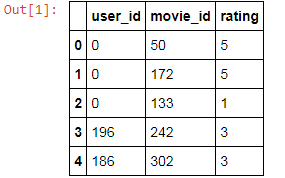

We end up with a DataFrame that has user_id, movie_id, and rating. For example, user_id 0 rated movie_id 50, which I believe is Star Wars, 5 stars, and so on and so forth.


The next thing we have to figure out is aggregate information about the ratings for each movie. We use the groupby() function in pandas to actually group everything by movie_id. We're going to combine together all the ratings for each individual movie, and we're going to output the number of ratings and the average rating score, that is the mean, for each movie:

```
movieProperties = ratings.groupby('movie_id').agg({'rating': 
 [np.size, np.mean]}) 
movieProperties.head() 
```

Let's go ahead and do that - comes back pretty quickly, here's how the output looks like:

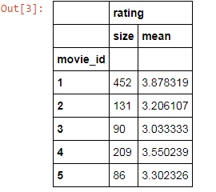

This gives us another DataFrame that tells us, for example, movie_id 1 had 452 ratings (which is a measure of its popularity, that is, how many people actually watched it and rated it), and a mean review score of 3.8. So, 452 people watched movie_id 1, and they gave it an average review of 3.87, which is pretty good.

Now, the raw number of ratings isn't that useful to us. I mean I don't know if 452 means it's popular or not. So, to normalize that, what we're going to do is basically measure that against the maximum and minimum number of ratings for each movie. We can do that using the lambda function. So, we can apply a function to an entire DataFrame this way.

What we're going to do is use the np.min() and np.max() functions to find the maximum number of ratings and the minimum number of ratings found in the entire dataset. So, we'll take the most popular movie and the least popular movie and find the range there, and normalize everything against that range:

```
movieNumRatings = pd.DataFrame(movieProperties['rating']['size']) 
movieNormalizedNumRatings = movieNumRatings.apply(lambda x: (x - np.min(x)) / (np.max(x) - np.min(x))) 
movieNormalizedNumRatings.head() 
```

What this gives us, when we run it, is the following:

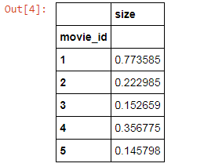

This is basically a measure of popularity for each movie, on a scale of 0 to 1. So, a score of 0 here would mean that nobody watched it, it's the least popular movie, and a score of 1 would mean that everybody watched, it's the most popular movie, or more specifically, the movie that the most people watched. So, we have a measure of movie popularity now that we can use for our distance metric.

Next, let's extract some general information. So, it turns out that there is a u.item file that not only contains the movie names, but also all the genres that each movie belongs to:

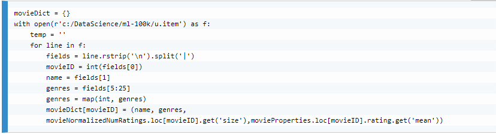

The code above will actually go through each line of u.item. We're doing this the hard way; we're not using any pandas functions; we're just going to use straight-up Python this time. Again, make sure you change that path to wherever you installed this information.

Next, we open our u.item file, and then iterate through every line in the file one at a time. We strip out the new line at the end and split it based on the pipe-delimiters in this file. Then, we extract the movieID, the movie name and all of the individual genre fields. So basically, there's a bunch of 0s and 1s in 19 different fields in this source data, where each one of those fields represents a given genre. We then construct a Python dictionary in the end that maps movie IDs to their names, genres, and then we also fold back in our rating information. So, we will have name, genre, popularity on a scale of 0 to 1, and the average rating. So, that's what this little snippet of code does. Let's run that! And, just to see what we end up with, we can extract the value for movie_id 1:

```
movieDict[1] 
```

Following is the output of the preceding code:

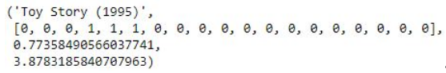

Entry 1 in our dictionary for movie_id 1 happens to be Toy Story, an old Pixar film from 1995 you've probably heard of. Next is a list of all the genres, where a 0 indicates it is not part of that genre, and 1 indicates it is part of that genre. There is a data file in the MovieLens dataset that will tell you what each of these genre fields actually corresponds to.

For our purposes, that's not actually important, right? We're just trying to measure distance between movies based on their genres. So, all that matters mathematically is how similar this vector of genres is to another movie, okay? The actual genres themselves, not important! We just want to see how same or different two movies are in their genre classifications. So we have that genre list, we have the popularity score that we computed, and we have there the mean or average rating for Toy Story. Okay, let's go ahead and figure out how to combine all this information together into a distance metric, so we can find the k-nearest neighbors for Toy Story, for example.

I've rather arbitrarily computed this ComputeDistance() function, that takes two movie IDs and computes a distance score between the two. We're going to base this, first of all, on the similarity, using a cosine similarity metric, between the two genre vectors. Like I said, we're just going to take the list of genres for each movie and see how similar they are to each other. Again, a 0 indicates it's not part of that genre, a 1 indicates it is.

We will then compare the popularity scores and just take the raw difference, the absolute value of the difference between those two popularity scores and use that toward the distance metric as well. Then, we will use that information alone to define the distance between two movies. So, for example, if we compute the distance between movie IDs 2 and 4, this function would return some distance function based only on the popularity of that movie and on the genres of those movies.

Now, imagine a scatter plot if you will, like we saw back in our example from the previous sections, where one axis might be a measure of genre similarity, based on cosine metric, the other axis might be popularity, okay? We're just finding the distance between these two things:

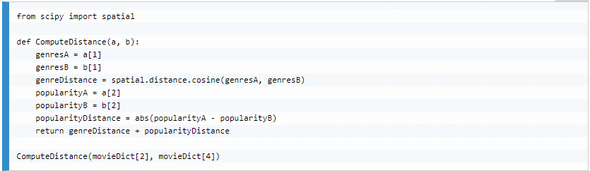

For this example, where we're trying to compute the distance using our distance metric between movies 2 and 4, we end up with a score of 0.8


Remember, a far distance means it's not similar, right? We want the nearest neighbors, with the smallest distance. So, a score of 0.8 is a pretty high number on a scale of 0 to 1. So that's telling me that these movies really aren't similar. Let's do a quick sanity check and see what these movies really are:

```
print movieDict[2] 
print movieDict[4] 
```

It turns out it's the movies GoldenEye and Get Shorty, which are pretty darn different movies:

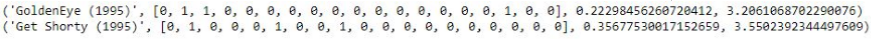

You know, you have James Bond action-adventure, and a comedy movie - not very similar at all! They're actually comparable in terms of popularity, but the genre difference did it in. Okay! So, let's put it all together!

Next, we're going to write a little bit of code to actually take some given movieID and find the KNN. So, all we have to do is compute the distance between Toy Story and all the other movies in our movie dictionary, and sort the results based on their distance score. That's what the following little snippet of code does. If you want to take a moment to wrap your head around it, it's fairly straightforward.

We have a little getNeighbors() function that will take the movie that we're interested in, and the K neighbors that we want to find. It'll iterate through every movie that we have; if it's actually a different movie than we're looking at, it will compute that distance score from before, append that to the list of results that we have, and sort that result. Then we will pluck off the K top results.


In this example, we're going to set K to 10, find the 10 nearest neighbors. We will find the 10 nearest neighbors using getNeighbors(), and then we will iterate through all these 10 nearest neighbors and compute the average rating from each neighbor. That average rating will inform us of our rating prediction for the movie in question.

**Note:**

As a side effect, we also get the 10 nearest neighbors based on our distance function, which we could call similar movies. So, that information itself is useful. Going back to that "Customers Who Watched Also Watched" example, if you wanted to do a similar feature that was just based on this distance metric and not actual behavior data, this might be a reasonable place to start, right?

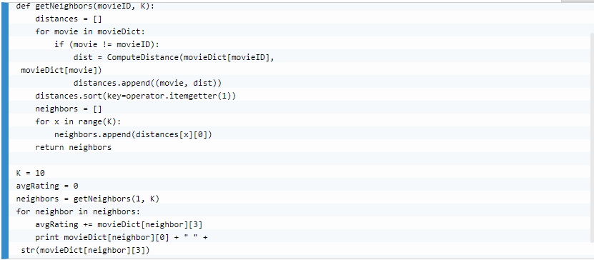

So, let's go ahead and run this, and see what we end up with. The output of the following code is as follows:

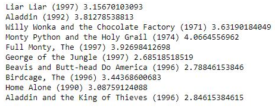

The results aren't that unreasonable. So, we are using as an example the movie Toy Story, which is movieID 1, and what we came back with, for the top 10 nearest neighbors, are a pretty good selection of comedy and children's movies. So, given that Toy Story is a popular comedy and children's movie, we got a bunch of other popular comedy and children's movies; so, it seems to work! We didn't have to use a bunch of fancy collaborative filtering algorithms, these results aren't that bad.

Next, let's use KNN to predict the rating, where we're thinking of the rating as the classification in this example:

```
avgRating 
```

Following is the output of the preceding code:

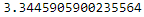

We end up with a predicted rating of 3.34, which actually isn't all that different from the actual rating for that movie, which was 3.87. So not great, but it's not too bad either! I mean it actually works surprisingly well, given how simple this algorithm is!

### Activity

Most of the complexity in this example was just in determining our distance metric, and you know we intentionally got a little bit fancy there just to keep it interesting, but you can do anything else you want to. So, if you want fiddle around with this, I definitely encourage you to do so. Our choice of 10 for K was completely out of thin air, I just made that up. How does this respond to different K values? Do you get better results with a higher value of K? Or with a lower value of K? Does it matter?

If you really want to do a more involved exercise you can actually try to apply it to train/test, to actually find the value of K that most optimally can predict the rating of the given movie based on KNN. And, you can use different distance metrics, I kind of made that up too! So, play around the distance metric, maybe you can use different sources of information, or weigh things differently. It might be an interesting thing to do. Maybe, popularity isn't really as important as the genre information, or maybe it's the other way around. See what impact that has on your results too. So, go ahead and mess with these algorithms, mess with the code and run with it, and see what you can get! And, if you do find a significant way of improving on this, share that with your classmates.


### A PCA example with the Iris dataset

Let's apply principal component analysis to the Iris dataset. This is a 4D dataset that we're going to reduce down to 2 dimensions. We're going to see that we can actually still preserve most of the information in that dataset, even by throwing away half of the dimensions. It's pretty cool stuff, and it's pretty simple too. Let's dive in and do some principal component analysis and cure the curse of dimensionality. Go ahead and open up the `PCA.ipynb` file.

#### Open Notebook
The Notebook opens in a new browser window. You can create a new notebook or open a local one. Check out the local folder `work` for several notebooks. Open and run `PCA.ipynb` in the `work` folder.


It's actually very easy to do using scikit-learn, as usual! Again, PCA is a dimensionality reduction technique. It sounds very science-fictiony, all this talk of higher dimensions. But, just to make it more concrete and real again, a common application is image compression. You can think of an image of a black and white picture, as 3 dimensions, where you have width, as your x-axis, and your y-axis of height, and each individual cell has some brightness value on a scale of 0 to 1, that is black or white, or some value in between. So, that would be 3D data; you have 2 spatial dimensions, and then a brightness and intensity dimension on top of that.

If you were to distill that down to say 2 dimensions alone, that would be a compressed image and, if you were to do that in a technique that preserved the variance in that image as well as possible, you could still reconstruct the image, without a whole lot of loss in theory. So, that's dimensionality reduction, distilled down to a practical example.

Now, we're going to use a different example here using the Iris dataset, and scikit-learn includes this. All it is is a dataset of various Iris flower measurements, and the species classification for each Iris in that dataset. And it has also, like I said before, the length and width measurement of both the petal and the sepal for each Iris specimen. So, between the length and width of the petal, and the length and width of the sepal we have 4 dimensions of feature data in our dataset.


We want to distill that down to something we can actually look at and understand, because your mind doesn't deal with 4 dimensions very well, but you can look at 2 dimensions on a piece of paper pretty easily. Let's go ahead and load that up:

```
from sklearn.datasets import load_iris 
from sklearn.decomposition import PCA 
import pylab as pl 
from itertools import cycle 
 
iris = load_iris() 
 
numSamples, numFeatures = iris.data.shape 
print numSamples 
print numFeatures 
print list(iris.target_names) 
```

There's a handy dandy load_iris() function built into scikit-learn that will just load that up for you with no additional work; so you can just focus on the interesting part. Let's take a look at what that dataset looks like, the output of the preceding code is as follows:

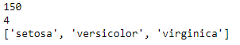

You can see that we are extracting the shape of that dataset, which means how many data points we have in it, that is 150, and how many features, or how many dimensions that dataset has, and that is 4. So, we have 150 Iris specimens in our dataset, with 4 dimensions of information. Again, that is the length and width of the sepal, and the length and width of the petal, for a total of 4 features, which we can think of as 4 dimensions.

We can also print out the list of target names in this dataset, which are the classifications,and we can see that each Iris belongs to one of three different species: Setosa, Versicolor, or Virginica. That's the data that we're working with: 150 Iris specimens, classified into one of 3 species, and we have 4 features associated with each Iris.

Let's look at how easy PCA is. Even though it's a very complicated technique under the hood, doing it is just a few lines of code. We're going to assign the entire Iris dataset and we're going to call it X. We will then create a PCA model, and we're going to keep n_components=2, because we want 2 dimensions, that is, we're going to go from 4 to 2.

We're going to use whiten=True, that means that we're going to normalize all the data, and make sure that everything is nice and comparable. Normally you will want to do that to get good results. Then, we will fit the PCA model to our Iris dataset X. We can use that model then, to transform that dataset down to 2 dimensions. Let's go ahead and run that. It happened pretty quickly!

```
X = iris.data 
pca = PCA(n_components=2, whiten=True).fit(X) 
X_pca = pca.transform(X) 
```

Please think about what just happened there. We actually created a PCA model to reduce 4 dimensions down to 2, and it did that by choosing 2 4D vectors, to create hyperplanes around, to project that 4D data down to 2 dimensions. You can actually see what those 4D vectors are, those eigenvectors, by printing out the actual components of PCA. So, PCA stands for Principal Component Analysis, those principal components are the eigenvectors that we chose to define our planes about:

```
print pca.components_ 
```

Output to the preceding code is as follows:

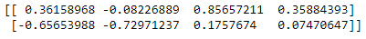

You can actually look at those values, they're not going to mean a lot to you, because you can't really picture 4 dimensions anyway, but we did that just so you can see that it's actually doing something with principal components. So, let's evaluate our results:

```
print pca.explained_variance_ratio_ 
print sum(pca.explained_variance_ratio_) 
```

The PCA model gives us back something called explained_variance_ratio. Basically, that tells you how much of the variance in the original 4D data was preserved as I reduced it down to 2 dimensions. So, let's go ahead and take a look at that:

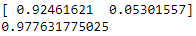

What it gives you back is actually a list of 2 items for the 2 dimensions that we preserved. This is telling me that in the first dimension I can actually preserve 92% of the variance in the data, and the second dimension only gave me an additional 5% of variance. If I sum it together, these 2 dimensions that I projected my data down into, I still preserved over 97% of the variance in the source data. We can see that 4 dimensions weren't really necessary to capture all the information in this dataset, which is pretty interesting. It's pretty cool stuff!

If you think about it, why do you think that might be? Well, maybe the overall size of the flower has some relationship to the species at its center. Maybe it's the ratio of length to width for the petal and the sepal. You know, some of these things probably move together in concert with each other for a given species, or for a given overall size of a flower. So, perhaps there are relationships between these 4 dimensions that PCA is extracting on its own. It's pretty cool, and pretty powerful stuff. Let's go ahead and visualize this.

The whole point of reducing this down to 2 dimensions was so that we could make a nice little 2D scatter plot of it, at least that's our objective for this little example here. So, we're going to do a little bit of Matplotlib magic here to do that. There is some sort of fancy stuff going on here that I should at least mention. So, what we're going to do is create a list of colors: red, green and blue. We're going to create a list of target IDs, so that the values 0, 1, and 2 map to the different Iris species that we have.

What we're going to do is zip all this up with the actual names of each species. The for loop will iterate through the 3 different Iris species, and as it does that, we're going to have the index for that species, a color associated with it, and the actual human-readable name for that species. We'll take one species at a time and plot it on our scatter plot just for that species with a given color and the given label. We will then add in our legend and show the results:

```
colors = cycle('rgb') 
target_ids = range(len(iris.target_names)) 
pl.figure() 
for i, c, label in zip(target_ids, colors, iris.target_names): 
    pl.scatter(X_pca[iris.target == i, 0], X_pca[iris.target == i, 1], 
        c=c, label=label) 
pl.legend() 
pl.show()
```

The following is what we end up with:

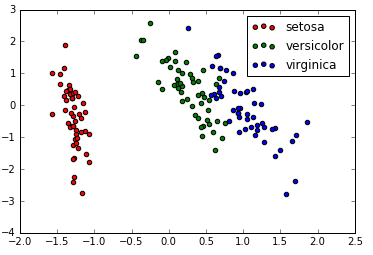

That is our 4D Iris data projected down to 2 dimensions. Pretty interesting stuff! You can see it still clusters together pretty nicely. You know, you have all the Virginicas sitting together, all the Versicolors sitting in the middle, and the Setosas way off on the left side. It's really hard to imagine what these actual values represent. But, the important point is, we've projected 4D data down to 2D, and in such a way that we still preserve the variance. We can still see clear delineations between these 3 species. A little bit of intermingling going on in there, it's not perfect you know. But by and large, it was pretty effective.

### Activity

As you recall from explained_variance_ratio, we actually captured most of the variance in a single dimension. Maybe the overall size of the flower is all that really matters in classifying it; and you can specify that with one feature. So, go ahead and modify the results if you are feeling up to it. See if you can get away with 2 dimensions, or 1 dimension instead of 2! So, go change that n_components to 1, and see what kind of variance ratio you get.

What happens? Does it makes sense? Play around with it, get some familiarity with it. That is dimensionality reduction, principal component analysis, and singular value decomposition all in action. Very, very fancy terms, and you know, to be fair it is some pretty fancy math under the hood. But as you can see, it's a very powerful technique and with scikit-learn, it's not hard to apply. So, keep that in your tool chest.
