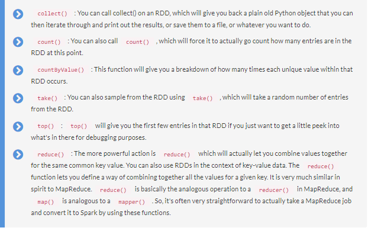
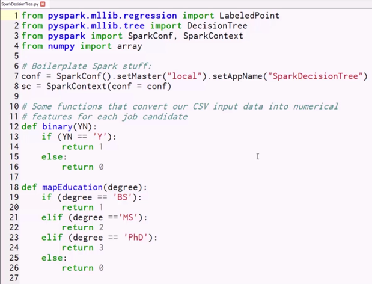
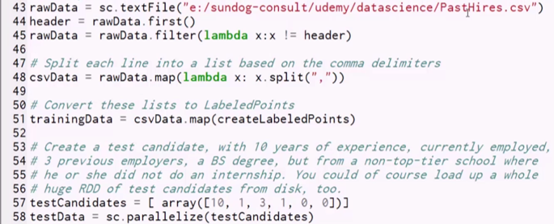
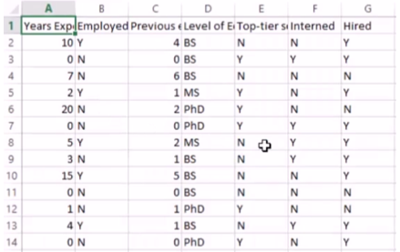
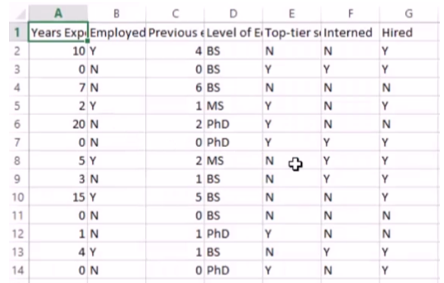
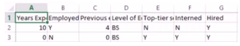
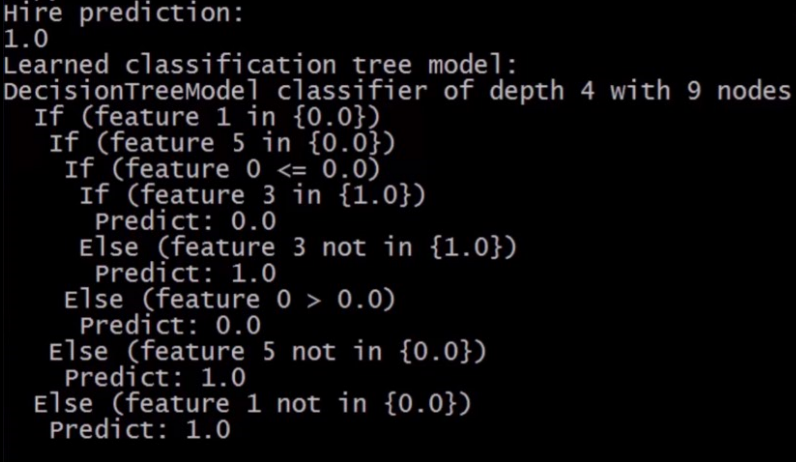
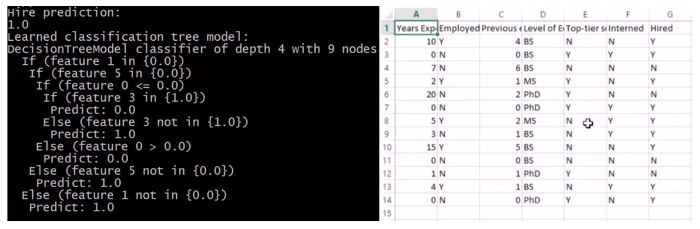
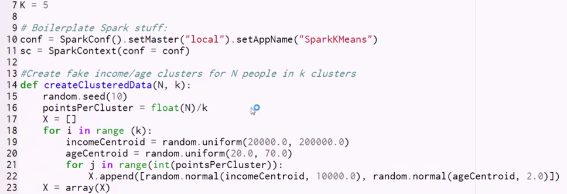
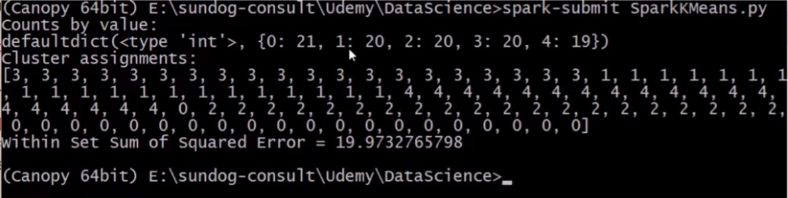

Lab : Apache Spark - Machine Learning on Big Data - Part 1
-------------------------------------

In this lab, we'll cover the following topics:

- Installing and working with Spark
- Resilient Distributed Datasets (RDDs)
- The MLlib (Machine Learning Library)

### Terminal

Now, move in the directory which contains the source code.

`cd ~/work/datascience-machine-learning`

**Note:**
- The supplied commands in the next steps MUST be run from your `datascience-machine-learning` directory. 
- There should be terminal opened already. You can also open New terminal by Clicking `File` > `New` > `Terminal` from the top menu.
- To copy and paste: use **Control-C** and to paste inside of a terminal, use **Control-V**

#### Install pyspark
PySpark is available in pypi. To install just run `pip install pyspark sklearn` 

**Note:** Above packages are already installed.


### The SparkContext object

You always start your Spark scripts by getting a SparkContext object, and this is the object that embodies the guts of Spark. It is what is going to give you your RDDs to process on, so it is what generates the objects that you use in your processing.

You know, you don't actually think about the SparkContext very much when you're actually writing Spark programs, but it is sort of the substrate that is running them for you under the hood. If you're running in the Spark shell interactively, it has an sc object already available for you that you can use to create RDDs. In a standalone script, however, you will have to create that SparkContext explicitly, and you'll have to pay attention to the parameters that you use because you can actually tell the Spark context how you want that to be distributed. Should I take advantage of every core that I have available to me? Should I be running on a cluster or just standalone on my local computer? So, that's where you set up the fundamental settings of how Spark will operate.


**Creating RDDs**

Let's look at some little code snippets of actually creating RDDs, and I think it will all start to make a little bit more sense.

**Creating an RDD using a Python list**

The following is a very simple example:

```
nums = parallelize([1, 2, 3, 4]) 
```

If I just want to make an RDD out of a plain old Python list, I can call the parallelize() function in Spark. That will convert a list of stuff, in this case, just the numbers, 1, 2, 3, 4, into an RDD object called nums.

That is the simplest case of creating an RDD, just from a hard-coded list of stuff. That list could come from anywhere; it doesn't have to be hard-coded either, but that kind of defeats the purpose of big data. I mean, if I have to load the entire Dataset into memory before I can create an RDD from it, what's the point?

**Loading an RDD from a text file**

I can also load an RDD from a text file, and that could be anywhere.

```
sc.textFile("file:///c:/users/frank/gobs-o-text.txt")  
```

In this example, I have a giant text file that's the entire encyclopedia or something. I'm reading that from my local disk here, but I could also use s3n if I want to host this file on a distributed AmazonS3 bucket, or hdfs if I want to refer to data that's stored on a distributed HDFS cluster (that stands for Hadoop Distributed File System if you're not familiar with HDFS). When you're dealing with big data and working with a Hadoop cluster, usually that's where your data will live.

That line of code will actually convert every line of that text file into its own row in an RDD. So, you can think of the RDD as a database of rows, and, in this example, it will load up my text file into an RDD where every line, every row, contains one line of text. I can then do further processing in that RDD to parse or break out the delimiters in that data. But that's where I start from.

Remember when we talked about ETL and ELT earlier in the book? This is a good example of where you might actually be loading raw data into a system and doing the transform on the system itself that you used to query your data. You can take raw text files that haven't been processed at all and use the power of Spark to actually transform those into more structured data.

It can also talk to things like Hive, so if you have an existing Hive database set up at your company, you can create a Hive context that's based on your Spark context. How cool is that? Take a look at this example code:

```
hiveCtx = HiveContext(sc)  rows = hiveCtx.sql("SELECT name, age FROM users")  
```

You can actually create an RDD, in this case called rows, that's generated by actually executing a SQL query on your Hive database.

### More ways to create RDDs

There are more ways to create RDDs as well. You can create them from a JDBC connection. Basically any database that supports JDBC can also talk to Spark and have RDDs created from it. Cassandra, HBase, Elasticsearch, also files in JSON format, CSV format, sequence files object files, and a bunch of other compressed files like ORC can be used to create RDDs. I don't want to get into the details of all those, you can get a book and look those up if you need to, but the point is that it's very easy to create an RDD from data, wherever it might be, whether it's on a local filesystem or a distributed data store.

Again, RDD is just a way of loading and maintaining very large amounts of data and keeping track of it all at once. But, conceptually within your script, an RDD is just an object that contains a bunch of data. You don't have to think about the scale, because Spark does that for you.

#### RDD operations
Now, there are two different types of classes of things you can do on RDDs once you have them, you can do transformations, and you can do actions.

#### Transformations
Let's talk about transformations first. Transformations are exactly what they sound like. It's a way of taking an RDD and transforming every row in that RDD to a new value, based on a function you provide. Let's look at some of those functions:

- **map() and flatmap():** map and flatmap are the functions you'll see the most often. Both of these will take any function that you can dream up, that will take, as input, a row of an RDD, and it will output a transformed row. For example, you might take raw input from a CSV file, and your map operation might take that input and break it up into individual fields based on the comma delimiter, and return back a Python list that has that data in a more structured format that you can perform further processing on. You can chain map operations together, so the output of one map might end up creating a new RDD that you then do another transformation on, and so on, and so forth. Again, the key is, Spark can distribute those transformations across the cluster, so it might take part of your RDD and transform it on one machine, and another part of your RDD and transform it on another.

Like I said, map and flatmap are the most common transformations you'll see. The only difference is that map will only allow you to output one value for every row, whereas flatmap will let you actually output multiple new rows for a given row. So you can actually create a larger RDD or a smaller RDD than you started with using flatmap.

- **filter():** filter can be used if what you want to do is just create a Boolean function that says "should this row be preserved or not? Yes or no."
- **distinct():** distinct is a less commonly used transformation that will only return back distinct values within your RDD.
- **sample():** This function lets you take a random sample from your RDD
union(), intersection(), subtract() and Cartesian(): You can perform intersection operations like union, intersection, subtract, or even produce every cartesian combination that exists within an RDD.

### Using map()

Here's a little example of how you might use the map function in your work:

```
rdd = sc.parallelize([1, 2, 3, 4]) 
rdd.map(lambda x: x*x) 
```

Let's say I created an RDD just from the list 1, 2, 3, 4. I can then call rdd.map() with a lambda function of x that takes in each row, that is, each value of that RDD, calls it x, and then it applies the function x multiplied by x to square it. If I were to then collect the output of this RDD, it would be 1, 4, 9 and 16, because it would take each individual entry of that RDD and square it, and put that into a new RDD.


### Actions

You can also perform actions on an RDD, when you want to actually get a result. Here are some examples of what you can do:



Remember, too, that nothing actually happens in Spark until you call an action. Once you call one of those action methods, that's when Spark goes out and does its magic with directed acyclic graphs, and actually computes the optimal way to get the answer you want. But remember, nothing really occurs until that action happens. So, that can sometimes trip you up when you're writing Spark scripts, because you might have a little print statement in there, and you might expect to get an answer, but it doesn't actually appear until the action is actually performed.

That is Spark 101 in a nutshell. Those are the basics you need for Spark programming. Basically, what is an RDD and what are the things you can do to an RDD. Once you get those concepts, then you can write some Spark code. Let's change tack now and talk about MLlib, and some specific features in Spark that let you do machine learning algorithms using Spark.


### Decision Trees in Spark with MLlib


Now, up until this point we've been using IPython notebooks for our code, but you can't really use those very well with Spark. With Spark scripts, you need to actually submit them to the Spark infrastructure and run them in a very special way, and we'll see how that works shortly.

#### Exploring decision trees code
So, we are just looking at a raw Python script file now, without any of the usual embellishment of the IPython notebook stuff. let's walk through what's going on in the script.




First, we're going to import, from pyspark.mllib, the bits that we need from the machine learning library for Spark.

```
from pyspark.mllib.regression import LabeledPoint 
from pyspark.mllib.tree import DecisionTree 
```

We need the LabeledPoint class, which is a data type required by the DecisionTree class, and the DecisionTree class itself, imported from mllib.tree.

Next, pretty much every Spark script you see is going to include this line, where we import SparkConf and SparkContext:

```
from pyspark import SparkConf, SparkContext 
```

This is needed to create the SparkContext object that is kind of the root of everything you do in Spark.

And finally, we're going to import the array library from numpy:

```
from numpy import array 
```

Yes, you can still use NumPy, and scikit-learn, and whatever you want within Spark scripts. You just have to make sure, first of all, that these libraries are installed on every machine that you intend to run it on.

If you're running on a cluster, you need to make sure that those Python libraries are already in place somehow, and you also need to understand that Spark will not make the scikit-learn methods, for example, magically scalable. You can still call these functions in the context of a given map function, or something like that, but it's only going to run on that one machine within that one process. Don't lean on that stuff too heavily, but, for simple things like managing arrays, it's totally an okay thing to do.

### Creating the SparkContext

Now, we'll start by setting up our SparkContext, and giving it a SparkConf, a configuration.

```
conf = SparkConf().setMaster("local").setAppName("SparkDecisionTree") 
```

This configuration object says, I'm going to set the master node to "local", and this means that I'm just running on my own local desktop, I'm not actually running on a cluster at all, and I'm just going to run in one process. I'm also going to give it an app name of "SparkDecisionTree," and you can call that whatever you want, Fred, Bob, Tim, whatever floats your boat. It's just what this job will appear as if you were to look at it in the Spark console later on.

And then we will create our SparkContext object using that configuration:

```
sc = SparkContext(conf = conf) 
```

That gives us an sc object we can use for creating RDDs.


Next, we have a bunch of functions:

```
# Some functions that convert our CSV input data into numerical 
# features for each job candidate 
def binary(YN): 
    if (YN == 'Y'): 
        return 1 
    else: 
        return 0 
 
def mapEducation(degree): 
    if (degree == 'BS'): 
        return 1 
    elif (degree =='MS'): 
        return 2 
    elif (degree == 'PhD'): 
        return 3 
    else: 
        return 0 
 
# Convert a list of raw fields from our CSV file to a 
# LabeledPoint that MLLib can use. All data must be numerical... 
def createLabeledPoints(fields): 
    yearsExperience = int(fields[0]) 
    employed = binary(fields[1]) 
    previousEmployers = int(fields[2]) 
    educationLevel = mapEducation(fields[3]) 
    topTier = binary(fields[4]) 
    interned = binary(fields[5]) 
    hired = binary(fields[6]) 
 
    return LabeledPoint(hired, array([yearsExperience, employed, 
        previousEmployers, educationLevel, topTier, interned])) 
```

Let's just get down these functions for now, and we'll come back to them later.

### Importing and cleaning our data

Let's go to the first bit of Python code that actually gets executed in this script.



The first thing we're going to do is load up this PastHires.csv file, and that's the same file we used in the decision tree exercise that we did earlier in this course.

Let's pause quickly to remind ourselves of the content of that file. If you remember right, we have a bunch of attributes of job candidates, and we have a field of whether or not we hired those people. What we're trying to do is build up a decision tree that will predict - would we hire or not hire a person given those attributes?

Now, let's take a quick peek at the PastHires.csv, which will be an Excel file.



You can see that Excel actually imported this into a table, but if you were to look at the raw text you'd see that it's made up of comma-separated values.

The first line is the actual headings of each column, so what we have above are the number of years of prior experience, is the candidate currently employed or not, number of previous employers, the level of education, whether they went to a top-tier school, whether they had an internship while they were in school, and finally, the target that we're trying to predict on, whether or not they got a job offer in the end of the day. Now, we need to read that information into an RDD so we can do something with it.


Let's go back to our script:

```
rawData = sc.textFile("./PastHires.csv") 
header = rawData.first() 
rawData = rawData.filter(lambda x:x != header) 
```

The first thing we need to do is read that CSV data in, and we're going to throw away that first row, because that's our header information, remember. So, here's a little trick for doing that. We start off by importing every single line from that file into a raw data RDD, and I could call that anything I want, but we're calling it sc.textFile. SparkContext has a textFile function that will take a text file and create a new RDD, where each entry, each line of the RDD, consists of one line of input.

**Note:**

Make sure you change the path to that file to wherever you actually installed it, otherwise it won't work.


Now, I'm going to extract the first line, the first row from that RDD, by using the first function. So, now the header RDD will contain one entry that is just that row of column headers. And now, look what's going on in the above code, I'm using filter on my original data that contains all of the information in that CSV file, and I'm defining a filter function that will only let lines through if that line is not equal to the contents of that initial header row. What I've done here is, I've taken my raw CSV file and I've stripped out the first line by only allowing lines that do not equal that first line to survive, and I'm returning that back to the rawData RDD variable again. So, I'm taking rawData, filtering out that first line, and creating a new rawData that only contains the data itself. With me so far? It's not that complicated.

Now, we're going to use a map function. What we need to do next is start to make more structure out of this information. Right now, every row of my RDD is just a line of text, it is comma-delimited text, but it's still just a giant line of text, and I want to take that comma-separated value list and actually split it up into individual fields. At the end of the day, I want each RDD to be transformed from a line of text that has a bunch of information separated by commas into a Python list that has actual individual fields for each column of information that I have. So, that's what this lambda function does:

```
csvData = rawData.map(lambda x: x.split(",")) 
```

It calls the built-in Python function split, which will take a row of input, and split it on comma characters, and divide that into a list of every field delimited by commas.

The output of this map function, where I passed in a lambda function that just splits every line into fields based on commas, is a new RDD called csvData. And, at this point, csvData is an RDD that contains, on every row, a list where every element is a column from my source data. Now, we're getting close.

It turns out that in order to use a decision tree with MLlib, a couple of things need to be true. First of all, the input has to be in the form of LabeledPoint data types, and it all has to be numeric in nature. So, we need to transform all of our raw data into data that can actually be consumed by MLlib, and that's what the createLabeledPoints function that we skipped past earlier does. We'll get to that in just a second, first here's the call to it:

```
trainingData = csvData.map(createLabeledPoints) 
```


We're going to call a map on csvData, and we are going to pass it the createLabeledPoints function, which will transform every input row into something even closer to what we want at the end of the day. So, let's look at what createLabeledPoints does:

```
def createLabeledPoints(fields): 
    yearsExperience = int(fields[0]) 
    employed = binary(fields[1]) 
    previousEmployers = int(fields[2]) 
    educationLevel = mapEducation(fields[3]) 
    topTier = binary(fields[4]) 
    interned = binary(fields[5]) 
    hired = binary(fields[6]) 
 
    return LabeledPoint(hired, array([yearsExperience, employed, 
        previousEmployers, educationLevel, topTier, interned])) 
```

It takes in a list of fields, and just to remind you again what that looks like, let's pull up that .csv Excel file again:



So, at this point, every RDD entry has a field, it's a Python list, where the first element is the years of experience, second element is employed, so on and so forth. The problems here are that we want to convert those lists to Labeled Points, and we want to convert everything to numerical data. So, all these yes and no answers need to be converted to ones and zeros. These levels of experience need to be converted from names of degrees to some numeric ordinal value. Maybe we'll assign the value zero to no education, one can mean BS, two can mean MS, and three can mean PhD, for example. Again, all these yes/no values need to be converted to zeros and ones, because at the end of the day, everything going into our decision tree needs to be numeric, and that's what createLabeledPoints does. Now, let's go back to the code and run through it:

```
def createLabeledPoints(fields): 
    yearsExperience = int(fields[0]) 
    employed = binary(fields[1]) 
    previousEmployers = int(fields[2]) 
    educationLevel = mapEducation(fields[3]) 
    topTier = binary(fields[4]) 
    interned = binary(fields[5]) 
    hired = binary(fields[6]) 
 
    return LabeledPoint(hired, array([yearsExperience, employed, 
        previousEmployers, educationLevel, topTier, interned])) 
```


First, it takes in our list of StringFields ready to convert it into LabeledPoints, where the label is the target value-was this person hired or not? 0 or 1-followed by an array that consists of all the other fields that we care about. So, this is how you create a LabeledPoint that the DecisionTree MLlib class can consume. So, you see in the above code that we're converting years of experience from a string to an integer value, and for all the yes/no fields, we're calling this binary function, that I defined up at the top of the code, but we haven't discussed yet:

```
def binary(YN): 
    if (YN == 'Y'): 
        return 1 
    else: 
        return 0 
```

All it does is convert the character yes to 1, otherwise it returns 0. So, Y will become 1, N will become 0. Similarly, I have a mapEducation function:

```
def mapEducation(degree): 
    if (degree == 'BS'): 
        return 1 
    elif (degree =='MS'): 
        return 2 
    elif (degree == 'PhD'): 
        return 3 
    else: 
        return 0 
```

As we discussed earlier, this simply converts different types of degrees to an ordinal numeric value in exactly the same way as our yes/no fields.

As a reminder, this is the line of code that sent us running through those functions:

```
trainingData = csvData.map(createLabeledPoints)
``` 

At this point, after mapping our RDD using that createLabeledPoints function, we now have a trainingData RDD, and this is exactly what MLlib wants for constructing a decision tree.


Creating a test candidate and building our decision tree
Let's create a little test candidate we can use, so we can use our model to actually predict whether someone new would be hired or not. What we're going to do is create a test candidate that consists of an array of the same values for each field as we had in the CSV file:

```
testCandidates = [ array([10, 1, 3, 1, 0, 0])] 
```

Let's quickly compare that code with the Excel document so you can see the array mapping:



Again, we need to map these back to their original column representation, so that 10, 1, 3, 1, 0, 0 means 10 years of prior experience, currently employed, three previous employers, a BS degree, did not go to a top-tier school and did not do an internship. We could actually create an entire RDD full of candidates if we wanted to, but we'll just do one for now.

Next, we'll use parallelize to convert that list into an RDD:

```
testData = sc.parallelize(testCandidates) 
```

Nothing new there. Alright, now for the magic let's move to the next code block:

```
model = DecisionTree.trainClassifier(trainingData, numClasses=2, 
        categoricalFeaturesInfo={1:2, 3:4, 4:2, 5:2}, 
        impurity='gini', maxDepth=5, maxBins=32) 

```

We are going to call DecisionTree.trainClassifier, and this is what will actually build our decision tree itself. We pass in our trainingData, which is just an RDD full of LabeledPoint arrays, numClasses=2, because we have, basically, a yes or no prediction that we're trying to make, will this person be hired or not? The next parameter is called categoricalFeaturesInfo, and this is a Python dictionary that maps fields to the number of categories in each field. So, if you have a continuous range available to a given field, like the number of years of experience, you wouldn't specify that at all in here, but for fields that are categorical in nature, such as what degree do they have, for example, that would say fieldID3, mapping to the degree attained, which has four different possibilities: no education, BS, MS, and PhD. For all of the yes/no fields, we're mapping those to 2 possible categories, yes/no or 0/1 is what we converted those to.

Continuing to move through our DecisionTree.trainClassifier call, we are going to use the 'gini' impurity metric as we measure the entropy. We have a maxDepth of 5, which is just an upper boundary on how far we're going to go, that can be larger if you wish. Finally, maxBins is just a way to trade off computational expense if you can, so it just needs to at least be the maximum number of categories you have in each feature. Remember, nothing really happens until we call an action, so we're going to actually use this model to make a prediction for our test candidate.

We use our DecisionTree model, which contains a decision tree that was trained on our test training data, and we tell that to make a prediction on our test data:

```
predictions = model.predict(testData) 
print ('Hire prediction:') 
results = predictions.collect() 
for result in results: 
     print (result) 
```

We'll get back a list of predictions that we can then iterate through. So, predict returns a plain old Python object and is an action that I can collect. Let me rephrase that a little bit: collect will return a Python object on our predictions, and then we can iterate through every item in that list and print the result of the prediction.

We can also print out the decision tree itself by using toDebugString:

```
print('Learned classification tree model:') 
print(model.toDebugString()) 
```

That will actually print out a little representation of the decision tree that it created internally, that you can follow through in your own head. So, that's kind of cool too.

### Running the script

Alright, feel free to take some time, stare at this script a little bit more, digest what's going on, but, if you're ready, let's move on and actually run this beast. So, to do so, you can't just run it directly from Canopy. We're going to go to the Tools menu and open up a Canopy Command Prompt, and this just opens up a Windows command prompt with all the necessary environment variables in place for running Python scripts in Canopy. Make sure that the working directory is the directory that you installed all of the course materials into.

#### Run Code

All we need to do is call spark-submit, so this is a script that lets you run Spark scripts from Python, and then the name of the script, `SparkDecisionTree.py`. That's all I have to do.

```
spark-submit SparkDecisionTree.py 
```

**Note:** We can also run python code by running:

```
python SparkDecisionTree.py
```


When it's finished, you should see the below output:



So, in the above image, you can see in the test person that we put in above, we have a prediction that this person would be hired, and I've also printed out the decision tree itself, so it's kind of cool. Now, let's bring up that Excel document once more so we can compare it to the output:



We can walk through this and see what it means. So, in our output decision tree we actually end up with a depth of four, with nine different nodes, and, again, if we remind ourselves what these different fields correlate to, the way to read this is: If (feature 1 in 0), so that means if the employed is No, then we drop down to feature 5. This list is zero-based, so feature 5 in our Excel document is internships. We can run through the tree like that: this person is not currently employed, did not do an internship, has no prior years of experience and has a Bachelor's degree, we would not hire this person. Then we get to the Else clauses. If that person had an advanced degree, we would hire them, just based on the data that we had that we trained it on. So, you can work out what these different feature IDs mean back to your original source data, remember, you always start counting at 0, and interpret that accordingly. Note that all the categorical features are expressed in Boolean in this list of possible categories that it saw, whereas continuous data is expressed numerically as less than or greater than relationships.

And there you have it, an actual decision tree built using Spark and MLlib that actually works and makes sense. Pretty awesome stuff.

### K-Means Clustering in Spark

Alright, let's look at another example of using Spark in MLlib, and this time we're going to look at k-means clustering, and just like we did with decision trees, we're going to take the same example that we did using scikit-learn and we're going to do it in Spark instead, so it can actually scale up to a massive Dataset. So, again, I've made sure to close out of everything else, and I'm going to go into my book materials and open up the SparkKMeans Python script, and let's study what's going on in.



Alright, so again, we begin with some boilerplate stuff.

```
from pyspark.mllib.clustering import KMeans 
from numpy import array, random 
from math import sqrt 
from pyspark import SparkConf, SparkContext 
from sklearn.preprocessing import scale 
```


We're going to import the KMeans package from the clustering MLlib package, we're going to import array and random from numpy, because, again, we're free to use whatever you want, this is a Python script at the end of the day, and MLlib often does require numpy arrays as input. We're going to import the sqrt function and the usual boilerplate stuff, we need SparkConf and SparkContext, pretty much every time from pyspark. We're also going to import the scale function from scikit-learn. Again, it's OK to use scikit-learn as long as you make sure its installed in every machine that you're going to be running this job on, and also don't assume that scikit-learn will magically scale itself up just because you're running it on Spark. But, since I'm only using it for the scaling function, it's OK. Alright, let's go ahead and set things up.

I'm going to create a global variable first:

```
K=5 
```

I'm going to run k-means clustering in this example with a K of 5, meaning with five different clusters. I'm then going to go ahead and set up a local SparkConf just running on my own desktop:

```
conf = SparkConf().setMaster("local").setAppName("SparkKMeans") 
sc = SparkContext(conf = conf) 
```

I'm going to set the name of my application to SparkKMeans and create a SparkContext object that I can then use to create RDDs that run on my local machine. We'll skip past the createClusteredData function for now, and go to the first line of code that gets run.

```
data = sc.parallelize(scale(createClusteredData(100, K)))  
```

- The first thing we're going to do is create an RDD by parallelizing in some fake data that I'm creating, and that's what the createClusteredData function does. Basically, I'm telling you to create 100 data points clustered around K centroids, and this is pretty much identical to the code that we looked at when we played with k-means clustering earlier in the book. If you want a refresher, go ahead and look back at that lab. Basically, what we're going to do is create a bunch of random centroids around which we normally distribute some age and income data. So, what we're doing is trying to cluster people based on their age and income, and we are fabricating some data points to do that. That returns a numpy array of our fake data.

- Once that result comes back from createClusteredData, I'm calling scale on it, and that will ensure that my ages and incomes are on comparable scales. Now, remember the section we studied saying you have to remember about data normalization? This is one of those examples where it is important, so we are normalizing that data with scale so that we get good results from k-means.
- And finally, we parallelize the resulting list of arrays into an RDD using parallelize. Now our data RDD contains all of our fake data. All we have to do, and this is even easier than a decision tree, is call KMeans.train on our training data.

```
clusters = KMeans.train(data, K, maxIterations=10, 
        initializationMode="random") 
```

We pass in the number of clusters we want, our K value, a parameter that puts an upper boundary on how much processing it's going to do; we then tell it to use the default initialization mode of k-means where we just randomly pick our initial centroids for our clusters before we start iterating on them, and back comes the model that we can use. We're going to call that clusters.

Alright, now we can play with that cluster.


Let's start by printing out the cluster assignments for each one of our points. So, we're going to take our original data and transform it using a lambda function:

```
resultRDD = data.map(lambda point: clusters.predict(point)).cache() 
```

This function is just going to transform each point into the cluster number that is predicted from our model. Again, we're just taking our RDD of data points. We're calling clusters.predict to figure out which cluster our k-means model is assigning them to, and we're just going to put the results in our resultRDD. Now, one thing I want to point out here is this cache call, in the above code.

An important thing when you're doing Spark is that any time you're going to call more than one action on an RDD, it's important to cache it first, because when you call an action on an RDD, Spark goes off and figures out the DAG for it, and how to optimally get to that result.


It will go off and actually execute everything to get that result. So, if I call two different actions on the same RDD, it will actually end up evaluating that RDD twice, and if you want to avoid all of that extra work, you can cache your RDD in order to make sure that it does not recompute it more than once.

By doing that, we make sure these two subsequent operations do the right thing:

```
print ("Counts by value:") 
counts = resultRDD.countByValue() 
print (counts) 
 
print ("Cluster assignments:") 
results = resultRDD.collect() 
print (results) 
```

In order to get an actual result, what we're going to do is use countByValue, and what that will do is give us back an RDD that has how many points are in each cluster. Remember, resultRDD currently has mapped every individual point to the cluster it ended up with, so now we can use countByValue to just count up how many values we see for each given cluster ID. We can then easily print that list out. And we can actually look at the raw results of that RDD as well, by calling collect on it, and that will give me back every single points cluster assignment, and we can print out all of them.

#### Within set sum of squared errors (WSSSE)
Now, how do we measure how good our clusters are? Well, one metric for that is called the Within Set Sum of Squared Errors, wow, that sounds fancy! It's such a big term that we need an abbreviation for it, WSSSE. All it is, we look at the distance from each point to its centroid, the final centroid in each cluster, take the square of that error and sum it up for the entire Dataset. It's just a measure of how far apart each point is from its centroid. Obviously, if there's a lot of error in our model then they will tend to be far apart from the centroids that might apply, so for that we need a higher value of K, for example. We can go ahead and compute that value and print it out with the following code:

```
def error(point): 
    center = clusters.centers[clusters.predict(point)] 
    return sqrt(sum([x**2 for x in (point - center)])) 
 
WSSSE = data.map(lambda point: error(point)).reduce(lambda x, y: x + y) 
print("Within Set Sum of Squared Error = " + str(WSSSE)) 
```

There are a few important points:

- We introduced the use of a cache if you want to make sure that you don't do unnecessary recomputations on an RDD that you're going to use more than once.
- We introduced the use of the reduce function.
- We have a couple of interesting mapper functions as well here, so there's a lot to learn from in this example.

At the end of the day, it will just do k-means clustering, so let's go ahead and run it.

#### Run Code
Now, run the python code by running: `spark-submit SparkKMeans.py`


**Note:** We can also run python code by running:

```
python SparkKMeans.py
```




Remember, the output that we asked for was, first of all, a count of how many points ended up in each cluster. So, this is telling us that cluster 0 had 21 points in it, cluster 1 had 20 points in it, and so on and so forth. It ended up pretty evenly distributed, so that's a good sign.

Next, we printed out the cluster assignments for each individual point, and, if you remember, the original data that fabricated this data did it sequentially, so it's actually a good thing that you see all of the 3s together, and all the 1s together, and all the 4s together, it looks like it started to get a little bit confused with the 0s and 2s, but by and large, it seems to have done a pretty good job of uncovering the clusters that we created the data with originally.

And finally, we computed the WSSSE metric, it came out to 19.97 in this example. So, if you want to play around with this a little bit, . You can see what happens to that error metric as you increase or decrease the values of K, and think about why that may be. You can also experiment with what happens if you don't normalize all the data, does that actually affect your results in a meaningful way? Is that actually an important thing to do? And you can also experiment with the maxIterations parameter on the model itself and get a good feel of what that actually does to the final results, and how important it is. So, feel free to mess around with it and experiment away. That's k-means clustering done with MLlib and Spark in a scalable manner. Very cool stuff.
