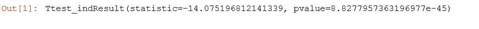
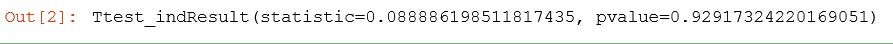
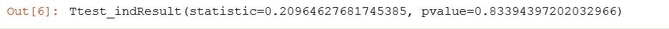
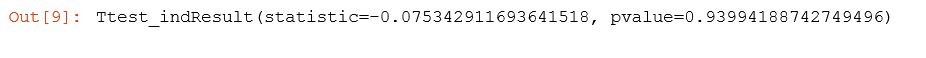
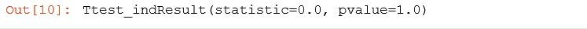

Lab : Testing and Experimental Design
-------------------------------------


In this lab, we'll cover the following topics:
- T-test and p-value
- Measuring t-statistics and p-values using Python
- Determining how long to run an experiment
- A/B test gotchas

#### Pre-reqs:
- Google Chrome (Recommended)

#### Lab Environment
Notebooks are ready to run. All packages have been installed. There is no requirement for any setup.

**Note:** Elev8ed Notebooks (powered by Jupyter) will be accessible at the port given to you by your instructor. Password for jupyterLab : `1234`

All Notebooks are present in `work/datascience-machine-learning` folder.

You can access jupyter lab at `http://<host-ip>/lab/workspaces/lab15_Design`


Let's go to an actual example and see how you might measure t-statistics and p-values using Python.

### Measuring t-statistics and p-values using Python

Let's fabricate some experimental data and use the t-statistic and p-value to determine whether a given experimental result is a real effect or not. We're going to actually fabricate some fake experimental data and run t-statistics and p-values on them, and see how it works and how to compute it in Python.

#### Open Notebook
The Notebook opens in a new browser window. You can create a new notebook or open a local one. Check out the local folder `work` for several notebooks. Open and run `TTest.ipynb` in the `work` folder.


#### Running A/B test on some experimental data
Let's imagine that we're running an A/B test on a website and we have randomly assigned our users into two groups, group A and group B. The A group is going to be our test subjects, our treatment group, and group B will be our control, basically the way the website used to be. We'll set this up with the following code:

```
import numpy as np 
from scipy import stats 
 
A = np.random.normal(25.0, 5.0, 10000) 
B = np.random.normal(26.0, 5.0, 10000) 
 
stats.ttest_ind(A, B) 
```

In this code example, our treatment group (A) is going to have a randomly distributed purchase behavior where they spend, on average, $25 per transaction, with a standard deviation of five and ten thousand samples, whereas the old website used to have a mean of $26 per transaction with the same standard deviation and sample size. We're basically looking at an experiment that had a negative result. All you have to do to figure out the t-statistic and the p-value is use this handy stats.ttest_ind method from scipy. What you do is, you pass it in your treatment group and your control group, and out comes your t-statistic as shown in the output here:



In this case, we have a t-statistic of -14. The negative indicates that it is a negative change, this was a bad thing. And the p-value is very, very small. So, that implies that there is an extremely low probability that this change is just a result of random chance.

**Note:**

Remember that in order to declare significance, we need to see a high t-value t-statistic, and a low p-value.

That's exactly what we're seeing here, we're seeing -14, which is a very high absolute value of the t-statistic, negative indicating that it's a bad thing, and an extremely low P-value, telling us that there's virtually no chance that this is just a result of random variation.

If you saw these results in the real world, you would pull the plug on this experiment as soon as you could.


**When there's no real difference between the two groups**

Just as a sanity check, let's go ahead and change things so that there's no real difference between these two groups. So, I'm going to change group B, the control group in this case, to be the same as the treatment, where the mean is 25, the standard deviation is unchanged, and the sample size is unchanged as shown here:

```
B = np.random.normal(25.0, 5.0, 10000) 
 
stats.ttest_ind(A, B) 
```

If we go ahead and run this, you can see our t-test ends up being below one now:



Remember this is in terms of standard deviation. So this implies that there's probably not a real change there unless we have a much higher p-value as well, over 30 percent.

Now, these are still relatively high numbers. You can see that random variation can be kind of an insidious thing. This is why you need to decide ahead of time what would be an acceptable limit for p-value.

You know, you could look at this after the fact and say, "30 percent odds, you know, that's not so bad, we can live with that," but, no. I mean, in reality and practice you want to see p-values that are below 5 percent, ideally below 1 percent, and a value of 30 percent means it's actually not that strong of a result. So, don't justify it after the fact, go into your experiment in knowing what your threshold is.

### Does the sample size make a difference?

Let's do some changes in the sample size. We're creating these sets under the same conditions. Let's see if we actually get a difference in behavior by increasing the sample size.

Sample size increased to six-digits
So, we're going to go from 10000 to 100000 samples as shown here:

```
A = np.random.normal(25.0, 5.0, 100000) 
B = np.random.normal(25.0, 5.0, 100000) 
 
stats.ttest_ind(A, B)
```

You can see in the following output that actually the p-value got a little bit lower and the t-test a little bit larger, but it's still not enough to declare a real difference. It's actually going in the direction you wouldn't expect it to go? Kind of interesting!



But these are still high values. Again, it's just the effect of random variance, and it can have more of an effect than you realize. Especially on a website when you're talking about order amounts.

Sample size increased seven-digits
Let's actually increase the sample size to 1000000, as shown here:

```
A = np.random.normal(25.0, 5.0, 1000000) 
B = np.random.normal(25.0, 5.0, 1000000) 
 
stats.ttest_ind(A, B) 
```

Here is the result:



What does that do? Well, now, we're back under 1 for the t-statistic, and our value's around 35 percent.

We're seeing these kind of fluctuations a little bit in either direction as we increase the sample size. This means that going from 10,000 samples to 100,000 to 1,000,000 isn't going to change your result at the end of the day. And running experiments like this is a good way to get a good gut feel as to how long you might need to run an experiment for. How many samples does it actually take to get a significant result? And if you know something about the distribution of your data ahead of time, you can actually run these sorts of models.

### A/A testing

If we were to compare the set to itself, this is called an A/A test as shown in the following code example:

```
stats.ttest_ind(A, A) 
```

We can see in the following output, a t-statistic of 0 and a p-value of 1.0 because there is in fact no difference whatsoever between these sets.



Now, if you were to run that using real website data where you were looking at the same exact people and you saw a different value, that indicates there's a problem in the system itself that runs your testing. At the end of the day, like I said, it's all a judgment call.

Go ahead and play with this, see what the effect of different standard deviations has on the initial datasets, or differences in means, and different sample sizes. I just want you to dive in, play around with these different datasets and actually run them, and see what the effect is on the t-statistic and the p-value. And hopefully that will give you a more gut feel of how to interpret these results.

**Note:**

Again, the important thing to understand is that you're looking for a large t-statistic and a small p-value. P-value is probably going to be what you want to communicate to the business. And remember, lower is better for p-value, you want to see that in the single digits, ideally below 1 percent before you declare victory.

