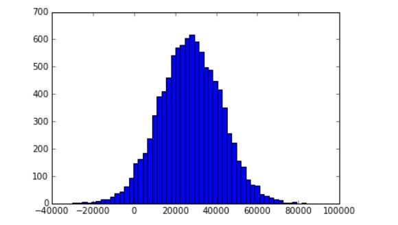
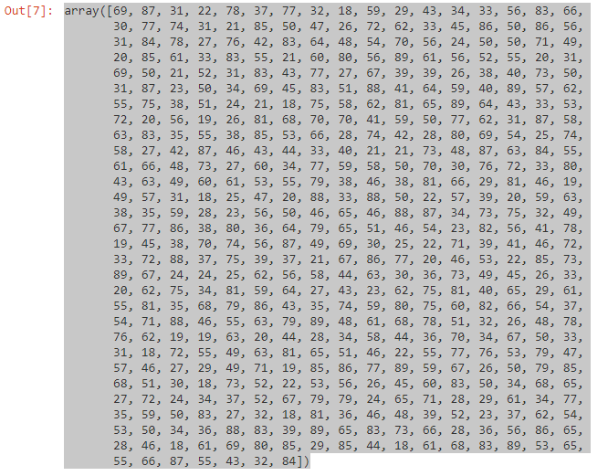
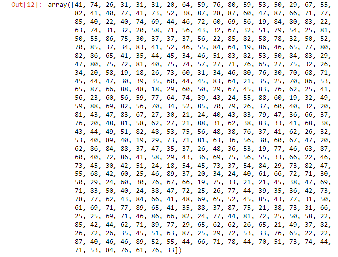
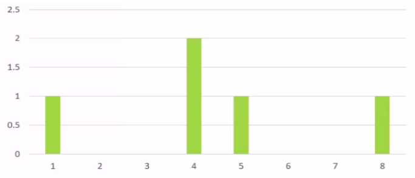
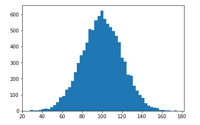

Lab : Statistics and Probability Refresher, and Python Practice - Part 1
-------------------------------------


In this lab, we are going to go through a few concepts of statistics and probability, which might be a refresher for some of you. These concepts are important to go through if you want to be a data scientist. We will see examples to understand these concepts better. We will also look at how to implement those examples using actual Python code.

We'll be covering the following topics in this lab:

- Types of data you may encounter and how to treat them accordingly
- Statistical concepts of mean, median, mode, standard deviation, and variance
- Probability density functions and probability mass functions

#### Pre-reqs:
- Google Chrome (Recommended)

#### Lab Environment
Notebooks are ready to run. All packages have been installed. There is no requirement for any setup.

**Note:** Elev8ed Notebooks (powered by Jupyter) will be accessible at the port given to you by your instructor. Password for jupyterLab : `1234`

All Notebooks are present in `work/datascience-machine-learning` folder.

You can access jupyter lab at `http://<host-ip>/lab/workspaces/lab2_Statistics_Probability`


### Mean, median, and mode

Let's look at some actual data and figure out how to measure these things.

#### Mean
The mean, as you probably know, is just another name for the average. To calculate the mean of a dataset, all you have to do is sum up all the values and divide it by the number of values that you have.

```
Sum of samples/Number of samples
```

Let's take this example, which calculates the mean (average) number of children per house in my neighborhood.

Let's say I went door-to-door in my neighborhood and asked everyone, how many children live in their household. (That, by the way, is a good example of discrete numerical data; remember from the previous section?) Let's say I go around and I found out that the first house has no kids in it, and the second house has two children, and the third household has three children, and so on and so forth. I amassed this little dataset of discrete numerical data, and to figure out the mean, all I do is add them all together and divide it by the number of houses that I went to.

Number of children in each house on my street:

```
0, 2, 3, 2, 1, 0, 0, 2, 0
```

The mean is (0+2+3+2+1+0+0+2+0)/9 = `1.11`

It comes out as 0 plus 2 plus 3 plus all the rest of these numbers divided by the total number of houses that I looked at, which is 9, and the mean number of children per house in my sample is 1.11. So, there you have it, mean.

**Median**

Median is a little bit different. The way you compute the median of the dataset is by sorting all the values (in either ascending or descending order), and taking the one that ends up in the middle.

So, for example, let's use the same dataset of children in my neighborhood

```
0, 2, 3, 2, 1, 0, 0, 2, 0
```

I would sort it numerically, and I can take the number that's slap dab in the middle of the data, which turns out to be 1.

```
0, 0, 0, 0, 1, 2, 2, 2, 3
```

Again, all I do is take the data, sort it numerically, and take the center point.

**Note:** If you have an even number of data points, then the median might actually fall in between two data points. It wouldn't be clear which one is actually the middle. In that case, all you do is, take the average of the two that do fall in the middle and consider that number as the median.


### Mode

Finally, we'll talk about mode. This doesn't really come up too often in practice, but you can't talk about mean and median without talking about mode. All mode means, is the most common value in a dataset.

Let's go back to my example of the number of kids in each house.

```
0, 2, 3, 2, 1, 0, 0, 2, 0
```

How many of each value are there:

```
0: 4, 1: 1, 2: 3, 3: 1
```

The MODE is 0

If I just look at what number occurs most frequently, it turns out to be 0, and the mode therefore of this data is 0. The most common number of children in a given house in this neighborhood is no kids, and that's all that means.

Now this is actually a pretty good example of continuous versus discrete data, because this only really works with discrete data. If I have a continuous range of data then I can't really talk about the most common value that occurs, unless I quantize that somehow into discrete values. So we've already run into one example here where the data type matters.

**Note:** Mode is usually only relevant to discrete numerical data, and not to continuous data.


### Using mean, median, and mode in Python

Let's start doing some real coding in Python and see how you compute the mean, median, and mode using Python in an IPython Notebook file.

So go ahead and open up the `MeanMedianMode.ipynb` file from the data files for this section if you'd like to follow along, which I definitely encourage you to do. If you need to go back to that earlier section on where to download these materials from, please go do that, because you will need these files for the section. Let's dive in!


#### Open Notebook
The Notebook opens in a new browser window. You can create a new notebook or open a local one. Check out the local folder `work` for notebooks. Open and run `MeanMedianMode.ipynb` in the `work` folder.


### Calculating mean using the NumPy package


In our Python notebook, remember to import the NumPy package into Python, which makes computing mean, median, and mode really easy. We're going to use the import numpy as np directive, which means we can use np as a shorthand to call numpy from now on.

Then we're going to create a list of numbers called incomes using the np.random.normal function.

```
import numpy as np 
 
incomes = np.random.normal(27000, 15000, 10000) 
np.mean(incomes) 
```

The three parameters of the np.random.normal function mean I want the data centered around 27000, with a standard deviation of 15000, and I want python to make 10000 data points in this list.

Once I do that, I compute the average of those data points, or the mean by just calling np.mean on incomes which is my list of data. It's just that simple.

Let's go ahead and run that. Make sure you selected that code block and then you can hit the play button to actually execute it, and since there is a random component to these income numbers, every time I run it, I'm going to get a slightly different result, but it should always be pretty close to 27000.

```
Out[1]: 27173.098561362742
```

OK, so that's all there is to computing the mean in Python, just using NumPy (np.mean) makes it super easy. You don't have to write a bunch of code or actually add up everything and count up how many items you had and do the division. NumPy mean, does all that for you.

### Visualizing data using matplotlib

Let's visualize this data to make it make a little more sense. So there's another package called matplotlib, and again we're going to talk about that a lot more in the future as well, but it's a package that lets me make pretty graphs in IPython Notebooks, so it's an easy way to visualize your data and see what's going on.

In this example, we are using matplotlib to create a histogram of our income data broken up into 50 different buckets. So basically, we're taking our continuous data and discretizing it, and then we can call show on matplotlib.pyplot to actually display this histogram in line. Refer to the following code:

```
%matplotlib inline 
import matplotlib.pyplot as plt 
plt.hist(incomes, 50) 
plt.show()
```

Go ahead and select the code block and hit play. It will actually create a new graph for us as follows:



If you're not familiar with histograms or you need a refresher, the way to interpret this is that for each one of these buckets that we've discretized our data into is showing the frequency of that data.

So, for example, around 27,000-ish we see there's about 600 data points in that neighborhood for each given range of values. There's a lot of people around the 27,000 mark, but when you get over to outliers like 80,000, there is not a whole lot, and apparently there's some poor souls that are even in debt at -40,000, but again, they're very rare and not probable because we defined a normal distribution, and this is what a normal probability curve looks like. Again, we're going to talk about that more in detail later, but I just want to get that idea in your head if you don't already know it.

### Calculating median using the NumPy package

Alright, so computing the median is just as simple as computing the mean. Just like we had NumPy mean, we have a NumPy median function as well.

We can just use the median function on incomes, which is our list of data, and that will give us the median. In this case, that came up to $26,911, which isn't very different from the mean of $26988. Again, the initial data was random, so your values will be slightly different.

```
np.median(incomes) 
```

The following is the output of the preceding code:

```
Out[4]: 26911.948365056276
```

We don't expect to see a lot of outliers because this is a nice normal distribution. Median and mean will be comparable when you don't have a lot of weird outliers.

### Analyzing the effect of outliers

Just to prove a point, let's add in an outlier. We'll take Donald Trump; I think he qualifies as an outlier. Let's go ahead and add his income in. So I'm going to manually add this to the data using np.append, and let's say add a billion dollars (which is obviously not the actual income of Donald Trump) into the incomes data.

```
incomes = np.append(incomes, [1000000000]) 
```

What we're going to see is that this outlier doesn't really change the median a whole lot, you know, that's still going to be around the same value $26,911, because we didn't actually change where the middle point is, with that one value, as shown in the following example:

```
np.median(incomes) 
```

This will output the following:

```
Out[5]: 26911.948365056276
```

This gives a new output of:

```
np.mean(incomes)
```

The following is the output of the preceding code:

```
Out[5]:127160.38252311043 
```

Aha, so there you have it! It is a great example of how median and mean, although people tend to equate them in commonplace language, can be very different, and tell a very different story. So that one outlier caused the average income in this dataset to be over $127160 a year, but the more accurate picture is closer to 27,000 dollars a year for the typical person in this dataset. We just had the mean skewed by one big outlier.

The moral of the story is: take anyone who talks about means or averages with a grain of salt if you suspect there might be outliers involved, and income distribution is definitely a case of that.

### Calculating mode using the SciPy package

Calculating mode using the SciPy package
Finally, let's look at mode. We will just generate a bunch of random integers, 500 of them to be precise, that range between 18 and 90. We're going to create a bunch of fake ages for people.

```
ages = np.random.randint(18, high=90, size=500) 
ages 
```

Your output will be random, but should look something like the following screenshot:



Now, SciPy, kind of like NumPy, is a bunch of like handy-dandy statistics functions, so we can import stats from SciPy using the following syntax. It's a little bit different than what we saw before.

```
from scipy import stats 
stats.mode(ages) 
```

The code means, from the scipy package import stats, and I'm just going to refer to the package as stats, Tha means that I don't need to have an alias like I did before with NumPy, just different way of doing it. Both ways work. Then, I used the stats.mode function on ages, which is our list of random ages. When we execute the above code, we get the following output:

```
Out[11]: ModeResult(mode=array([39]), count=array([12])) 
```

So in this case, the actual mode is 39 that turned out to be the most common value in that array. It actually occurred 12 times.

Now if I actually create a new distribution, I would expect a completely different answer because this data really is completely random what these numbers are. Let's execute the above code blocks again to create a new distribution.

```
ages = np.random.randint(18, high=90, size=500) 
ages

from scipy import stats 
stats.mode(ages) 
```

The output for randomizing the equation is as distribution is as follows:



Make sure you selected that code block and then you can hit the play button to actually execute it.

In this case, the mode ended up being the number 29, which occurred 14 times.

```
Out[11]: ModeResult(mode=array([29]), count=array([14]))
```

So, it's a very simple concept. You can do it a few more times just for fun. It's kind of like rolling the roulette wheel. We'll create a new distribution again.

There you have it, mean, median, and mode in a nutshell. It's very simple to do using the SciPy and NumPy packages.

### Exercise

You can open the Jupyter Notebook at `~/work/datascience-machine-learning/MeanMedianExercise.ipynb`

In the file, we have some random e-commerce data. What this data represents is the total amount spent per transaction, and again, just like with our previous example, it's just a normal distribution of data. We can run that, and your homework is to go ahead and find the mean and median of this data using the NumPy package. Pretty much the easiest assignment you could possibly imagine. All the techniques you need are in the `MeanMedianMode.ipynb` file that we used earlier.


### Standard deviation and variance

Let's talk about standard deviation and variance. The concepts and terms you've probably heard before, but let's go into a little bit more depth about what they really mean and how you compute them. It's a measure of the spread of a data distribution.


#### Identifying outliers with standard deviation
Here's a histogram of the actual data we were looking at in the preceding example for calculating variance.



Now we see that the number 4 occurred twice in our dataset, and then we had one 1, one 5, and one 8.

The standard deviation is usually used as a way to think about how to identify outliers in your dataset. If I say if I'm within one standard deviation of the mean of 4.4, that's considered to be kind of a typical value in a normal distribution. However, you can see in the preceding diagram, that the numbers 1 and 8 actually lie outside of that range. So if I take 4.4 plus or minus 2.24, we end up around 7 and 2, and 1 and 8 both fall outside of that range of a standard deviation. So we can say mathematically, that 1 and 8 are outliers. We don't have to guess and eyeball it. Now there is still a judgment call as to what you consider an outlier in terms of how many standard deviations a data point is from the mean.


You can generally talk about how much of an outlier a data point is by how many standard deviations (or sometimes how many-sigmas) from the mean it is.

So that's something you'll see standard deviation used for in the real world.

### Population variance versus sample variance


We'll use the sample data we were just studying for people standing in a line. We took the sum of the squared variances and divided by 5, that is the number of data points that we had, to get 5.04.

```
σ2 = (11.56 + 0.16 + 0.36 + 0.16 + 12.96) / 5 = 5.04
```

If we were to look at the sample variance, which is designated by S2, it is found by the sum of the squared variances divided by 4, that is (n - 1). This gives us the sample variance, which comes out to 6.3.

```
S2 = (11.56 + 0.16 + 0.36 + 0.16 + 12.96) / 4 = 6.3
```

So again, if this was some sort of sample that we took from a larger dataset, that's what you would do. If it was a complete dataset, you divide by the actual number. Okay, that's how we calculate population and sample variance.


### Analyzing standard deviation and variance on a histogram

The Notebook opens in a new browser window. You can create a new notebook or open a local one. Check out the local folder `work` for notebooks. Open and run `StdDevVariance.ipynb` in the `work` folder.


We will discuss this notebook in the next steps.


```
%matplotlib inline 
import numpy as np 
import matplotlib.pyplot as plt 
incomes = np.random.normal(100.0, 20.0, 10000) 
plt.hist(incomes, 50) 
plt.show() 
```

We use matplotlib to plot a histogram of some normally distributed random data, and we call it incomes. We're saying it's going to be centered around 100 (hopefully that's an hourly rate or something and not annual, or some weird denomination), with a standard deviation of 20 and 10,000 data points.

Let's go ahead and generate that by executing that above code block and plotting it as shown in the following graph:



We have 10,000 data points centered around 100. With a normal distribution and a standard deviation of 20, a measure of the spread of this data, you can see that the most common occurrence is around 100, and as we get further and further from that, things become less and less likely. The standard deviation point of 20 that we specified is around 80 and around 120. You can see in the histogram that this is the point where things start to fall off sharply, so we can say that things beyond that standard deviation boundary are unusual.

### Using Python to compute standard deviation and variance

Now, NumPy also makes it incredibly easy to compute the standard deviation and variance. If you want to compute the actual standard deviation of this dataset that we generated, you just call the std function right on the dataset itself. So, when NumPy creates the list, it's not just a normal Python list, it actually has some extra stuff tacked onto it so you can call functions on it, like std for standard deviation. Let's do that now:

```
incomes.std() 
```

This gives us something like the following output (remember that we used random data, so your figures won't be exactly the same as mine):

```
20.024538249134373 
```

When we execute that, we get a number pretty close to 20, because that's what we specified when we created our random data. We wanted a standard deviation of 20. Sure enough, 20.02, pretty close.

The variance is just a matter of calling var.

```
incomes.var() 
```

This gives me the following:

```
400.98213209104557 
```

It comes out to pretty close to 400, which is 202. Right, so the world makes sense! Standard deviation is just the square root of the variance, or you could say that the variance is the standard deviation squared. Sure enough, that works out, so the world works the way it should.

### Try it yourself

Try out different parameters on generating that normal data. Remember, this is a measure of the shape of the distribution of the data, so what happens if I change that center point? Does it matter? Does it actually affect the shape? Why don't you try it out and find out?

Try messing with the actual standard deviation, that we've specified, to see what impact that has on the shape of the graph. Maybe try a standard deviation of 30, and you know, you can see how that actually affects things. Let's make it even more dramatic, like 50. Just play around with 50. You'll see the graph starting to get a little bit fatter. Play around with different values, just get a feel of how these values work. This is the only way to really get an intuitive sense of standard deviation and variance. Mess around with some different examples and see the effect that it has.


