Lab : Predictive Models
------------------------


In this lab, we'll cover the following topics:

- Linear regression and how to implement it in Python
- Polynomial regression, its application and examples
- Multivariate regression and how to implement it in Python
- An example we'll build that predicts the price of a car using Python
- The concept of multi-level models and some things to know about them

#### Pre-reqs:
- Google Chrome (Recommended)

#### Lab Environment
Notebooks are ready to run. All packages have been installed. There is no requirement for any setup.

**Note:** Elev8ed Notebooks (powered by Jupyter) will be accessible at the port given to you by your instructor. Password for jupyterLab : `1234`

All Notebooks are present in `work/datascience-machine-learning` folder.

You can access jupyter lab at `<host-ip>:<port>/lab/workspaces/lab_


### Computing linear regression and r-squared using Python


Let's now play with linear regression and actually compute some linear regression and r-squared. We can start by creating a little bit of Python code here that generates some random-ish data that is in fact linearly correlated.

#### Open Notebook
The Notebook opens in a new browser window. You can create a new notebook or open a local one. Check out the local folder `work` for several notebooks. Open and run `LinearRegression.ipynb` in the `work` folder.


In this example I'm going to fake some data about page rendering speeds and how much people purchase, just like a previous example. We're going to fabricate a linear relationship between the amount of time it takes for a website to load and the amount of money people spend on that website:

```
%matplotlib inline
import numpy as np
from pylab import *
pageSpeeds = np.random.normal(3.0, 1.0, 1000)
purchaseAmount = 100 - (pageSpeeds + np.random.normal(0, 0.1, 1000)) * 3
scatter(pageSpeeds, purchaseAmount) 
```

All I've done here is I've made a random, a normal distribution of page speeds centered around 3 seconds with a standard deviation of 1 second. I've made the purchase amount a linear function of that. So, I'm making it 100 minus the page speeds plus some normal random distribution around it, times 3. And if we scatter that, we can see that the data ends up looking like this:

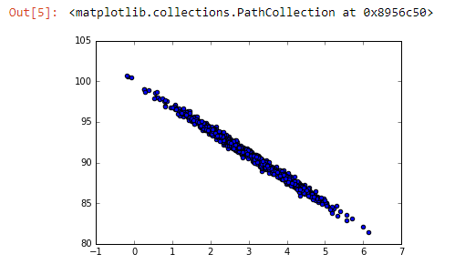

You can see just by eyeballing it that there's definitely a linear relationship going on there, and that's because we did hardcode a real linear relationship in our source data.


Now let's see if we can tease that out and find the best fit line using ordinary least squares. We talked about how to do ordinary least squares and linear regression, but you don't have to do any of that math yourself because the SciPy package has a stats package that you can import:

```
from scipy import stats

slope, intercept, r_value, p_value, std_err =     
stats.linregress(pageSpeeds, purchaseAmount) 
```

You can import stats from scipy, and then you can just call stats.linregress() on your two features. So, we have a list of page speeds (pageSpeeds) and a corresponding list of purchase amounts (purchaseAmount). The linregress() function will give us back a bunch of stuff, including the slope, the intercept, which is what I need to define my best fit line. It also gives us the r_value, from which we can get r-squared to measure the quality of that fit, and a couple of things that we'll talk about later on. For now, we just need slope, intercept, and r_value, so let's go ahead and run these. We'll begin by finding the linear regression best fit:

```
r_value ** 2
```

This is what your output should look like:

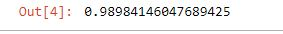

Now the r-squared value of the line that we got back is 0.99, that's almost 1.0. That means we have a really good fit, which isn't too surprising because we made sure there was a real linear relationship between this data. Even though there is some variance around that line, our line captures that variance. We have roughly the same amount of variance on either side of the line, which is a good thing. It tells us that we do have a linear relationship and our model is a good fit for the data that we have.

Let's plot that line:

```
import matplotlib.pyplot as plt
def predict(x):
return slope * x + intercept
fitLine = predict(pageSpeeds)
plt.scatter(pageSpeeds, purchaseAmount)
plt.plot(pageSpeeds, fitLine, c='r')
plt.show()
```

The following is the output to the preceding code:

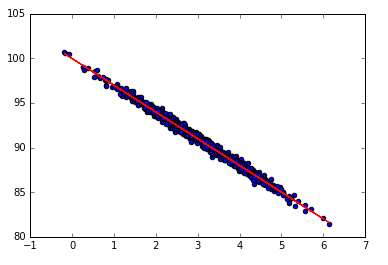

This little bit of code will create a function to draw the best fit line alongside the data. There's a little bit more Matplotlib magic going on here. We're going to make a fitLine list and we're going to use the predict() function we wrote to take the pageSpeeds,which is our x-axis, and create the Y function from that. So instead of taking the observations for amount spent, we're going to find the predicted ones just using the slope times x plus the intercept that we got back from the linregress() call above. Essentially here, we're going to do a scatter plot like we did before to show the raw data points, which are the observations.

Then we're also going to call plot on that same pyplot instance using our fitLine that we created using the line equation that we got back, and show them all both together. When we do that, it looks like the following graph:

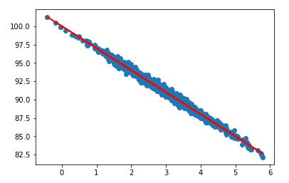

You can see that our line is in fact a great fit for our data! It goes right smack down the middle, and all you need to predict new values is this predict function. Given a new previously unseen page speed, we could predict the amount spent just using the slope times the page speed plus the intercept. That's all there is to it, and I think it's great!

### Activity for linear regression

Time now to get your hands dirty. Try increasing the random variation in the test data and see if that has any impact. Remember, the r-squared is a measure of the fit, of how much do we capture the variance, so the amount of variance, well... why don't you see if it actually makes a difference or not.

That's linear regression, a pretty simple concept. All we're doing is fitting a straight line to set of observations, and then we can use that line to make predictions of new values. That's all there is to it. But why limit yourself to a line? There's other types of regression we can do that are more complex. We'll explore these next.


### Implementing polynomial regression using NumPy

Fortunately, NumPy has a polyfit function that makes it super easy to play with this and experiment with different results, so let's go take a look. Time for fun with polynomial regression. I really do think it's fun, by the way. It's kind of cool seeing all that high school math actually coming into some practical application. Go ahead and open the `PolynomialRegression.ipynb` and let's have some fun.

#### Open Notebook
The Notebook opens in a new browser window. You can create a new notebook or open a local one. Check out the local folder `work` for several notebooks. Open and run `PolynomialRegression.ipynb` in the `work` folder.


Let's create a new relationship between our page speeds, and our purchase amount fake data, and this time we're going to create a more complex relationship that's not linear. We're going to take the page speed and make it some function of the division of page speed for the purchase amount:

```
%matplotlib inline
from pylab import *
np.random.seed(2)
pageSpeeds = np.random.normal(3.0, 1.0, 1000)
purchaseAmount = np.random.normal(50.0, 10.0, 1000) / pageSpeeds
scatter(pageSpeeds, purchaseAmount)
```

If we do a scatter plot, we end up with the following

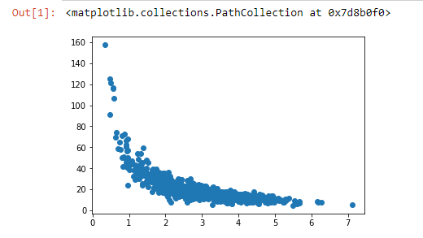

By the way, if you're wondering what the `np.random.seed` line does, it creates a random seed value, and it means that when we do subsequent random operations they will be deterministic. By doing this we can make sure that, every time we run this bit of code, we end up with the same exact results. That's going to be important later on because I'm going to suggest that you come back and actually try different fits to this data to compare the fits that you get. So, it's important that you're starting with the same initial set of points.

You can see that that's not really a linear relationship. We could try to fit a line to it and it would be okay for a lot of the data, maybe down at the right side of the graph, but not so much towards the left. We really have more of an exponential curve.

Now it just happens that NumPy has a polyfit() function that allows you to fit any degree polynomial you want to this data. So, for example, we could say our x-axis is an array of the page speeds (pageSpeeds) that we have, and our y-axis is an array of the purchase amounts (purchaseAmount) that we have. We can then just call np.polyfit(x, y, 4), meaning that we want a fourth degree polynomial fit to this data.

```
x = np.array(pageSpeeds)
y = np.array(purchaseAmount)
p4 = np.poly1d(np.polyfit(x, y, 4))
```
Let's go ahead and run that. It runs pretty quickly, and we can then plot that. So, we're going to create a little graph here that plots our scatter plot of original points versus our predicted points.

```
import matplotlib.pyplot as plt

xp = np.linspace(0, 7, 100)
plt.scatter(x, y)
plt.plot(xp, p4(xp), c='r')
plt.show()
```

The output looks like the following graph:

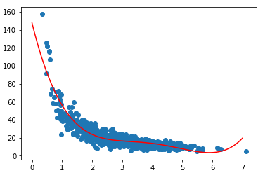

At this point, it looks like a reasonably good fit. What you want to ask yourself though is, "Am I overfitting? Does my curve look like it's actually going out of its way to accommodate outliers?" I find that that's not really happening. I don't really see a whole lot of craziness going on.

If I had a really high order polynomial, it might swoop up at the top to catch that one outlier and then swoop downwards to catch the outliers there, and get a little bit more stable through where we have a lot of density, and maybe then it could potentially go all over the place trying to fit the last set of outliers at the end. If you see that sort of nonsense, you know you have too many orders, too many degrees in your polynomial, and you should probably bring it back down because, although it fits the data that you observed, it's not going to be useful for predicting data you haven't seen.


### Computing the r-squared error

Now we can measure the r-squared error. By taking the y and the predicted values (p4(x)) in the r2_score() function that we have in sklearn.metrics, we can compute that.

```
from sklearn.metrics import r2_score
r2 = r2_score(y, p4(x))

print r2
```

The output is as follows:

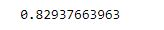

Our code compares a set of observations to a set of predictions and computes r-squared for you, and with just one line of code! Our r-squared for this turns out to be 0.829, which isn't too bad. Remember, zero is bad, one is good. 0.82 is to pretty close to one, not perfect, and intuitively, that makes sense. You can see that our line is pretty good in the middle section of the data, but not so good out at the extreme left and not so good down at the extreme right. So, 0.82 sounds about right.

### Activity for polynomial regression

I recommend that you get down and dirty with this stuff. Try different orders of polynomials. Go back up to where we ran the polyfit() function and try different values there besides 4. You can use 1, and that would go back to a linear regression, or you could try some really high amount like 8, and maybe you'll start to see overfitting. So see what effect that has. You're going to want to change that. For example, let's go to a third-degree polynomial.

```
x = np.array(pageSpeeds)
y = np.array(purchaseAmount)

p4 = np.poly1d(np.polyfit(x, y, 3))  
```

Just keep hitting run to go through each step and you can see the it's effect as...

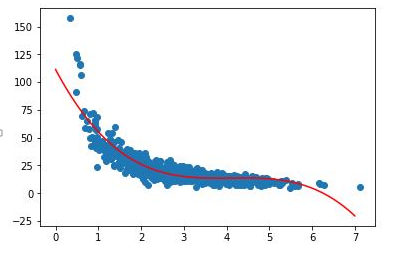

Our third-degree polynomial is definitely not as good a fit as the fourth-degree polynomial. If you actually measure the r-squared error, it would actually turn out worse, quantitatively; but if I go too high, you might start to see overfitting. So just have some fun with that, play around different values, and get a sense of what different orders of polynomials do to your regression. Go get your hands dirty and try to learn something.

So that's polynomial regression. Again, you need to make sure that you don't put more degrees at the problem than you need to. Use just the right amount to find what looks like an intuitive fit to your data. Too many can lead to overfitting, while too few can lead to a poor fit... so you can use both your eyeballs for now, and the r-squared metric, to figure out what the right number of degrees are for your data. Let's move on.


### Multivariate regression using Python

The Notebook opens in a new browser window. You can create a new notebook or open a local one. Check out the local folder `work` for several notebooks. Open and run `MultivariateRegression.ipynb` in the `work` folder.


Fortunately there's a statsmodel package available for Python that makes doing multivariate regression pretty easy. Let's just dive in and see how it works. Let's do some multivariate regression using Python. We're going to use some real data here about car values.

```
import pandas as pd
df = pd.read_excel('./cars.xls')
```

We're going to introduce a new package here called pandas, which lets us deal with tabular data really easily. It lets us read in tables of data and rearrange them, and modify them, and slice them and dice them in different ways. We're going to be using that a lot going forward.

We're going to import pandas as pd, and pd has a read_Excel() function that we can use to go ahead and read a Microsoft Excel spreadsheet from the Web through HTTP. So, pretty awesome capabilities of pandas there.


I've gone ahead and hosted that file for you on my own domain, and if we run that, it will load it into what's called a DataFrame object that we're referring to as df. Now I can call head() on this DataFrame to just show the first few lines of it:

```
df.head()
```

The following is the output for the preceding code:

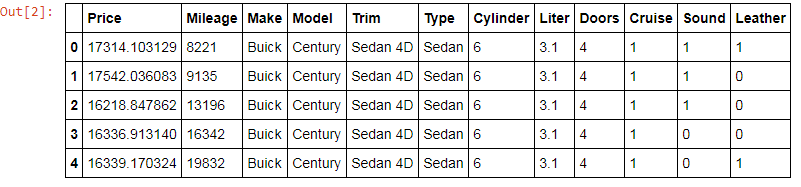

The actual dataset is much larger. This is just the first few samples. So, this is real data of mileage, make, model, trim, type, doors, cruise, sound and leather.

OK, now we're going to use pandas to split that up into the features that we care about. We're going to create a model that tries to predict the price just based on the mileage, the model, and the number of doors, and nothing else.

```
import statsmodels.api as sm

df['Model_ord'] = pd.Categorical(df.Model).codes
X = df[['Mileage', 'Model_ord', 'Doors']]
y = df[['Price']]

X1 = sm.add_constant(X)
est = sm.OLS(y, X1).fit()

est.summary() 
```

Now the problem that I run into is that the model is a text, like Century for Buick, and as you recall, everything needs to be a number when I'm doing this sort of analysis. In the code, I use this Categorical() function in pandas to actually convert the set of model names that it sees in the DataFrame into a set of numbers; that is, a set of codes. I'm going to say my input for this model on the x-axis is mileage (Mileage), model converted to an ordinal value (Model_ord), and the number of doors (Doors). What I'm trying to predict on the y-axis is the price (Price).


The next two lines of the code just create a model that I'm calling est that uses ordinary least squares, OLS, and fits that using the columns that I give it, Mileage, Model_ord, and Doors. Then I can use the summary call to print out what my model looks like:

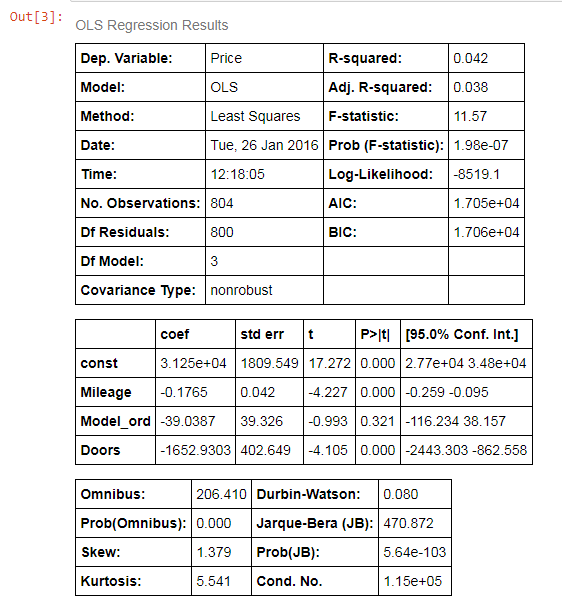

You can see here that the r-squared is pretty low. It's not that good of a model, really, but we can get some insight into what the various errors are, and interestingly, the lowest standard error is associated with the mileage.

Now I have said before that the coefficient is a way of determining which items matter, and that's only true though if your input data is normalized. That is, if everything's on the same scale of 0 to 1. If it's not, then these coefficients are kind of compensating for the scale of the data that it's seeing. If you're not dealing with normalized data, as in this case, it's more useful to look at the standard errors. In this case, we can see that the mileage is actually the biggest factor of this particular model. Could we have figured that out earlier? Well, we could have just done a little bit of slicing and dicing to figure out that the number of doors doesn't actually influence the price much at all. Let's run the following little line:

```
y.groupby(df.Doors).mean()
```

A little bit of pandas syntax there. It's pretty cool that you can do it in Python in one line of code! That will print out a new DataFrame that shows the mean price for the given number of doors:

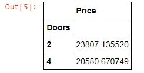

I can see the average two-door car sells for actually more than the average four-door car. If anything there's a negative correlation between number of doors and price, which is a little bit surprising. This is a small dataset, though, so we can't read a whole lot of meaning into it of course.

### Activity for multivariate regression

As an activity, please mess around with the fake input data where you want. You can download the data and mess around with the spreadsheet. Read it from your local hard drive instead of from HTTP, and see what kind of differences you can have. Maybe you can fabricate a dataset that has a different behavior and has a better model that fits it. Maybe you can make a wiser choice of features to base your model off of. So, feel free to mess around with that and let's move on.

We introduced pandas and the way to work with pandas and DataFrame objects. pandas a very powerful tool. We'll use it more in future sections, but make sure you're starting to take notice of these things because these are going to be important techniques in your Python skills for managing large amounts of data and organizing your data.
