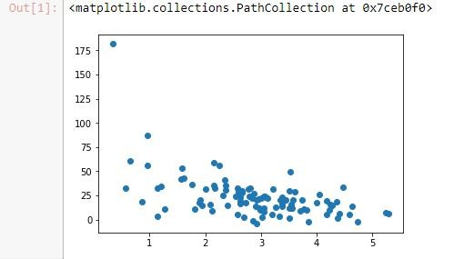
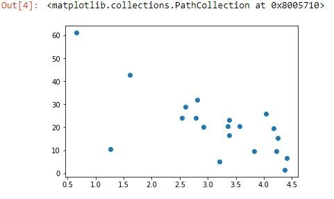
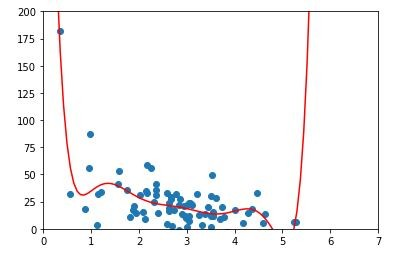
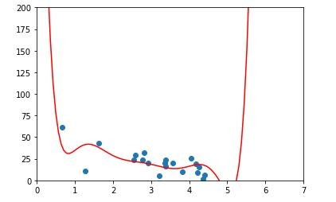
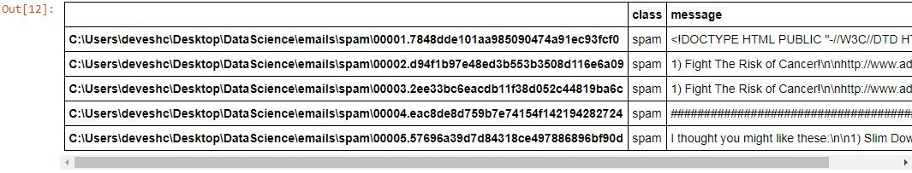
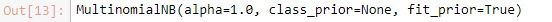
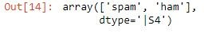

Lab : Machine Learning with Python - Part 1
-------------------------------------


In this lab, we'll cover the following topics:

- Supervised and unsupervised learning
- Avoiding overfitting by using train/test
- Bayesian methods
- Implementation of an e-mail spam classifier with Naïve Bayes

#### Pre-reqs:
- Google Chrome (Recommended)

#### Lab Environment
Notebooks are ready to run. All packages have been installed. There is no requirement for any setup.

**Note:** Elev8ed Notebooks (powered by Jupyter) will be accessible at the port given to you by your instructor. Password for jupyterLab : `1234`

All Notebooks are present in `work/datascience-machine-learning` folder.

You can access jupyter lab at `http://<host-ip>/lab/workspaces/lab7_Machine_Learning`


### Using train/test to prevent overfitting of a polynomial regression

Let's put train/test into action. So you might remember that a regression can be thought of as a form of supervised machine learning. Let's just take a polynomial regression, which we covered earlier, and use train/test to try to find the right degree polynomial to fit a given set of data.

#### Open Notebook
The Notebook opens in a new browser window. You can create a new notebook or open a local one. Check out the local folder `work` for several notebooks. Open and run `TrainTest.ipynb` in the `work` folder.


Just like in our previous example, we're going to set up a little fake dataset of randomly generated page speeds and purchase amounts, and I'm going to create a quirky little relationship between them that's exponential in nature.

```
%matplotlib inline 
import numpy as np 
from pylab import * 
 
np.random.seed(2) 
 
pageSpeeds = np.random.normal(3.0, 1.0, 100) 
purchaseAmount = np.random.normal(50.0, 30.0, 100) / pageSpeeds 
 
scatter(pageSpeeds, purchaseAmount) 
```

Let's go ahead and generate that data. We'll use a normal distribution of random data for both page speeds and purchase amount using the relationship as shown in the following screenshot:



Next, we'll split that data. We'll take 80% of our data, and we're going to reserve that for our training data. So only 80% of these points are going to be used for training the model, and then we're going to reserve the other 20% for testing that model against unseen data.

We'll use Python's syntax here for splitting the list. The first 80 points are going to go to the training set, and the last 20, everything after 80, is going to go to test set. You may remember this from our Python basics lab earlier on, where we covered the syntax to do this, and we'll do the same thing for purchase amounts here:

```
trainX = pageSpeeds[:80] 
testX = pageSpeeds[80:] 
 
trainY = purchaseAmount[:80] 
testY = purchaseAmount[80:] 
```

Now in our earlier sections, I've said that you shouldn't just slice your dataset in two like this, but that you should randomly sample it for training and testing. In this case though, it works out because my original data was randomly generated anyway, so there's really no rhyme or reason to where things fell. But in real-world data you'll want to shuffle that data before you split it.


We'll look now at a handy method that you can use for that purpose of shuffling your data. Also, if you're using the pandas package, there's some handy functions in there for making training and test datasets automatically for you. But we're going to do it using a Python list here. So let's visualize our training dataset that we ended up with. We'll do a scatter plot of our training page speeds and purchase amounts.

```
scatter(trainX, trainY) 
```

This is what your output should now look like:


Basically, 80 points that were selected at random from the original complete dataset have been plotted. It has basically the same shape, so that's a good thing. It's representative of our data. That's important!

Now let's plot the remaining 20 points that we reserved as test data.

```
scatter(testX, testY) 
```



Here, we see our remaining 20 for testing also has the same general shape as our original data. So I think that's a representative test set too. It's a little bit smaller than you would like to see in the real world, for sure. You probably get a little bit of a better result if you had 1,000 points instead of 100, for example, to choose from and reserved 200 instead of 20.


Now we're going to try to fit an 8th degree polynomial to this data, and we'll just pick the number 8 at random because I know it's a really high order and is probably overfitting.

Let's go ahead and fit our 8th degree polynomial using np.poly1d(np.polyfit(x, y, 8)), where x is an array of the training data only, and y is an array of the training data only. We are finding our model using only those 80 points that we reserved for training. Now we have this p4 function that results that we can use to predict new values:

```
x = np.array(trainX) 
y = np.array(trainY) 
 
p4 = np.poly1d(np.polyfit(x, y, 8)) 
```

Now we'll plot the polynomial this came up with against the training data. We can scatter our original data for the training data set, and then we can plot our predicted values against them:

```
import matplotlib.pyplot as plt 
 
xp = np.linspace(0, 7, 100) 
axes = plt.axes() 
axes.set_xlim([0,7]) 
axes.set_ylim([0, 200]) 
plt.scatter(x, y) 
plt.plot(xp, p4(xp), c='r') 
plt.show() 
```

You can see in the following graph that it looks like a pretty good fit, but you know that clearly it's doing some overfitting:




What's this craziness out at the right? I'm pretty sure our real data, if we had it out there, wouldn't be crazy high, as this function would implicate. So this is a great example of overfitting your data. It fits the data you gave it very well, but it would do a terrible job of predicting new values beyond the point where the graph is going crazy high on the right. So let's try to tease that out. Let's give it our test dataset:

```
testx = np.array(testX) 
testy = np.array(testY) 
 
axes = plt.axes() 
axes.set_xlim([0,7]) 
axes.set_ylim([0, 200]) 
plt.scatter(testx, testy) 
plt.plot(xp, p4(xp), c='r') 
plt.show() 
```

Indeed, if we plot our test data against that same function, well, it doesn't actually look that bad.



We got lucky and none of our test is actually out here to begin with, but you can see that it's a reasonable fit, but far from perfect. And in fact, if you actually measure the r-squared score, it's worse than you might think. We can measure that using the r2_score() function from sklearn.metrics. We just give it our original data and our predicted values and it just goes through and measures all the variances from the predictions and squares them all up for you:

```
from sklearn.metrics import r2_score  
r2 = r2_score(testy, p4(testx))  
print r2 
```

We end up with an r-squared score of just 0.3. So that's not that hot! You can see that it fits the training data a lot better:

```
from sklearn.metrics import r2_score  
r2 = r2_score(np.array(trainY), p4(np.array(trainX))) 
print r2 
```

The r-squared value turns out to be 0.6, which isn't too surprising, because we trained it on the training data. The test data is sort of its unknown, its test, and it did fail the test, quite frankly. 30%, that's an F!

So this has been an example where we've used train/test to evaluate a supervised learning algorithm, and like I said before, pandas has some means of making this even easier. We'll look at that a little bit later, and we'll also look at more examples of train/test, including k-fold cross validation, later in the book as well.


### Implementing a spam classifier with Naive Bayes

Let's write a spam classifier using Naive Bayes. You're going to be surprised how easy this is. In fact, most of the work ends up just being reading all the input data that we're going to train on and actually parsing that data in. The actual spam classification bit, the machine learning bit, is itself just a few lines of code. So that's usually how it works out: reading in and massaging and cleaning up your data is usually most of the work when you're doing data science, so get used to the idea!

#### Open Notebook
The Notebook opens in a new browser window. You can create a new notebook or open a local one. Check out the local folder `work` for several notebooks. Open and run `NaiveBayes.ipynb` in the `work` folder.


So the first thing we need to do is read all those e-mails in somehow, and we're going to again use pandas to make this a little bit easier. Again, pandas is a useful tool for handling tabular data. We import all the different packages that we're going to use within our example here, that includes the os library, the io library, numpy, pandas, and CountVectorizer and MultinomialNB from scikit-learn.


So what I have at the end of the day is a DataFrame object, basically a database with two columns, that contains message bodies, and whether it's spam or not. We can go ahead and run that, and we can use the head command from the DataFrame to actually preview what this looks like:

```
data.head() 
```

The first few entries in our DataFrame look like this: for each path to a given file full of e-mails we have a classification and we have the message body:



Alright, now for the fun part, we're going to use the MultinomialNB() function from scikit-learn to actually perform Naive Bayes on the data that we have.

```
vectorizer = CountVectorizer() 
counts = vectorizer.fit_transform(data['message'].values) 
 
classifier = MultinomialNB() 
targets = data['class'].values 
classifier.fit(counts, targets) 
```

This is what your output should now look like:



Once we build a MultinomialNB classifier, it needs two inputs. It needs the actual data that we're training on (counts), and the targets for each thing (targets). So counts is basically a list of all the words in each e-mail and the number of times that word occurs.

So this is what CountVectorizer() does: it takes the message column from the DataFrame and takes all the values from it. I'm going to call vectorizer.fit_transform which basically tokenizes or converts all the individual words seen in my data into numbers, into values. It then counts up how many times each word occurs.


Let's go ahead and run that. It runs pretty quickly! I'm going to use a couple of examples here. Let's try a message body that just says Free Money now!!! which is pretty clearly spam, and a more innocent message that just says "Hi Bob, how about a game of golf tomorrow?" So we're going to pass these in.

```
examples = ['Free Money now!!!', "Hi Bob, how about a game of golf tomorrow?"] 
example_counts = vectorizer.transform(examples) 
predictions = classifier.predict(example_counts) 
predictions 
```

The first thing we do is convert the messages into the same format that I trained my model on. So I use that same vectorizer that I created when creating the model to convert each message into a list of words and their frequencies, where the words are represented by positions in an array. Then once I've done that transformation, I can actually use the predict() function on my classifier, on that array of examples that have transformed into lists of words, and see what we come up with:



```
array(['spam', 'ham'], dtype='|S4') 
```

And sure enough, it works! So, given this array of two input messages, Free Money now!!! and Hi Bob, it's telling me that the first result came back as spam and the second result came back as ham, which is what I would expect. That's pretty cool. So there you have it.

### Activity

We had a pretty small dataset here, so you could try running some different e-mails through it if you want and see if you get different results. If you really want to challenge yourself, try applying train/test to this example. So the real measure of whether or not my spam classifier is good or not is not just intuitively whether it can figure out that Free Money now!!! is spam. You want to measure that quantitatively.

So if you want a little bit of a challenge, go ahead and try to split this data up into a training set and a test dataset. You can actually look up online how pandas can split data up into train sets and testing sets pretty easily for you, or you can do it by hand. Whatever works for you. See if you can actually apply your MultinomialNB classifier to a test dataset and measure its performance. So, if you want a little bit of an exercise, a little bit of a challenge, go ahead and give that a try.
